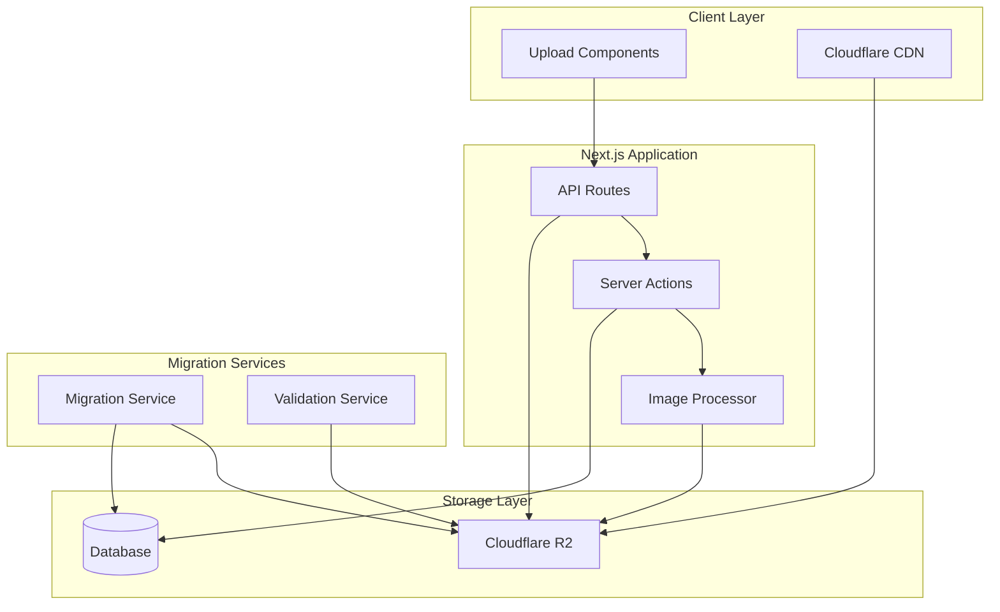
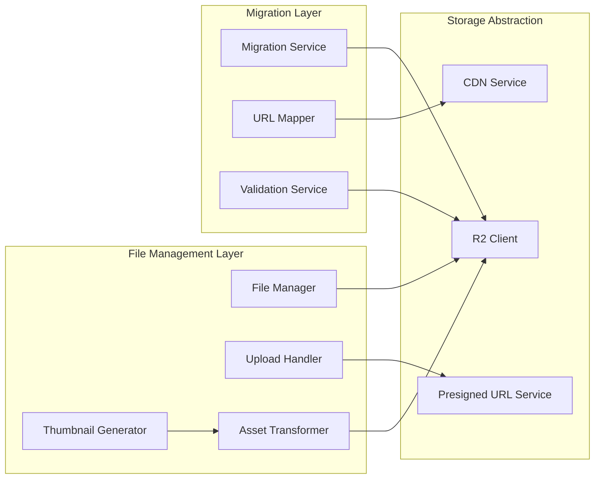

# Design Document: Cloudinary to Cloudflare R2 Migration

## Overview

This design outlines the architecture and implementation strategy for migrating the Next.js school ERP system from Cloudinary to Cloudflare R2 storage. The migration will replace all Cloudinary functionality with R2-based solutions while maintaining feature parity and improving cost efficiency.

The solution leverages Cloudflare R2's S3-compatible API, Sharp.js for server-side image processing, and a comprehensive migration strategy to ensure zero data loss during the transition.

## Architecture

### High-Level Architecture



### Component Architecture



## School-Based Folder Structure

### Multi-Tenant Storage Organization

The R2 storage system implements a school-based folder structure to ensure complete data isolation between different schools in the multi-tenant ERP system.

**Folder Hierarchy**:
```
bucket-root/
├── school-{schoolId}/
│   ├── students/
│   │   ├── {studentId}/
│   │   │   ├── avatar/
│   │   │   ├── documents/
│   │   │   └── certificates/
│   ├── teachers/
│   │   ├── {teacherId}/
│   │   │   ├── profile/
│   │   │   └── documents/
│   ├── events/
│   │   ├── {eventId}/
│   │   │   ├── banners/
│   │   │   └── gallery/
│   ├── announcements/
│   │   └── attachments/
│   ├── certificates/
│   │   └── templates/
│   ├── reports/
│   │   └── generated/
│   └── system/
│       ├── logos/
│       └── branding/
```

**Benefits**:
- **Data Isolation**: Complete separation of school data prevents cross-contamination
- **Security**: School-level access control and permissions
- **Backup & Recovery**: School-specific backup and restore operations
- **Migration**: Easier school-by-school migration from Cloudinary
- **Quota Management**: Per-school storage quota enforcement
- **Compliance**: Meets data residency and privacy requirements

**Key Generation Pattern**:
```typescript
// Pattern: school-{schoolId}/{folder}/{subfolder}/{filename}
const generateKey = (schoolId: string, folder: string, filename: string): string => {
  return `school-${schoolId}/${folder}/${filename}`;
};

// Examples:
// school-123/students/456/avatar/profile-abc123.jpg
// school-123/events/789/banner/event-banner-def456.webp
// school-456/certificates/templates/graduation-template.pdf
```

## Components and Interfaces

### 1. R2 Storage Client

**Purpose**: Core interface for all R2 storage operations

**Key Methods**:
- `uploadFile(schoolId: string, file: Buffer, key: string, metadata: FileMetadata): Promise<UploadResult>`
- `deleteFile(schoolId: string, key: string): Promise<void>`
- `generatePresignedUrl(schoolId: string, key: string, operation: 'GET' | 'PUT', expiresIn: number): Promise<string>`
- `listFiles(schoolId: string, prefix: string, maxKeys?: number): Promise<FileList>`
- `getFileMetadata(schoolId: string, key: string): Promise<FileMetadata>`

**Configuration**:
```typescript
interface R2Config {
  accountId: string;
  accessKeyId: string;
  secretAccessKey: string;
  bucketName: string;
  region: string;
  endpoint: string;
  customDomain?: string;
}
```

### 2. Upload Handler Service

**Purpose**: Manages file uploads with validation and processing

**Key Features**:
- File type validation (MIME type and extension)
- Size limit enforcement (5MB images, 50MB documents)
- Unique filename generation using nanoid
- Metadata extraction and storage
- Progress tracking for large uploads

**Interface**:
```typescript
interface UploadHandler {
  uploadImage(schoolId: string, file: File, folder: string): Promise<UploadResult>;
  uploadDocument(schoolId: string, file: File, folder: string): Promise<UploadResult>;
  validateFile(file: File, type: FileType): ValidationResult;
  generateUniqueKey(schoolId: string, originalName: string, folder: string): string;
}
```

### 3. Image Processing Service

**Purpose**: Server-side image processing using Sharp.js

**Capabilities**:
- Thumbnail generation (150x150, 300x300, 600x600)
- Format conversion (WebP, AVIF for modern browsers)
- Quality optimization and compression
- PDF first-page preview generation
- Batch processing for multiple variants

**Interface**:
```typescript
interface ImageProcessor {
  generateThumbnails(buffer: Buffer, sizes: ThumbnailSize[]): Promise<ProcessedImage[]>;
  optimizeImage(buffer: Buffer, options: OptimizationOptions): Promise<Buffer>;
  generatePdfPreview(pdfBuffer: Buffer): Promise<Buffer>;
  convertFormat(buffer: Buffer, targetFormat: ImageFormat): Promise<Buffer>;
}
```

### 4. Migration Service

**Purpose**: Handles bulk migration from Cloudinary to R2

**Migration Strategy**:
1. **Discovery Phase**: Scan database for all Cloudinary URLs
2. **Download Phase**: Fetch files from Cloudinary with retry logic
3. **Upload Phase**: Upload to R2 with metadata preservation
4. **Validation Phase**: Verify file integrity using checksums
5. **Update Phase**: Update database references to R2 URLs
6. **Cleanup Phase**: Optional Cloudinary resource cleanup

**Interface**:
```typescript
interface MigrationService {
  discoverCloudinaryUrls(schoolId?: string): Promise<CloudinaryAsset[]>;
  migrateAsset(schoolId: string, asset: CloudinaryAsset): Promise<MigrationResult>;
  validateMigration(schoolId: string, asset: CloudinaryAsset, r2Key: string): Promise<boolean>;
  updateDatabaseReferences(schoolId: string, oldUrl: string, newUrl: string): Promise<void>;
  generateMigrationReport(schoolId?: string): Promise<MigrationReport>;
  migrateSchoolAssets(schoolId: string): Promise<SchoolMigrationResult>;
}
```

### 6. Storage Quota Management Service

**Purpose**: Manages per-school storage quotas using existing UsageCounter and SubscriptionPlan models

**Key Features**:
- Real-time storage usage tracking via storageUsedMB
- Plan-based quota enforcement using features.storageGB
- Warning notifications at 80% usage threshold
- Super admin quota management interface
- Usage analytics and reporting

**Interface**:
```typescript
interface StorageQuotaService {
  checkQuota(schoolId: string): Promise<StorageQuotaStatus>;
  updateUsage(schoolId: string, sizeMB: number): Promise<void>;
  getUsageStats(schoolId: string): Promise<UsageCounter>;
  setCustomQuota(schoolId: string, limitMB: number): Promise<void>;
  getAllSchoolUsage(): Promise<SchoolStorageUsage[]>;
  sendQuotaWarning(schoolId: string): Promise<void>;
  syncQuotaFromPlan(schoolId: string): Promise<void>; // Sync from subscription plan
}

interface StorageQuotaStatus {
  isWithinLimit: boolean;
  currentUsageMB: number;
  maxLimitMB: number;
  percentageUsed: number;
  warningThreshold: number;
  planStorageGB: number;
}
```

### 7. CDN and URL Management

**Purpose**: Manages file URLs and CDN distribution

**Features**:
- Custom domain configuration for professional URLs
- URL signing for secure access
- Cache control headers optimization
- Legacy URL redirection support

**URL Structure**:
```
https://cdn.schoolerp.com/{schoolId}/{folder}/{filename}
https://cdn.schoolerp.com/school-123/students/12345/avatar/profile-abc123.jpg
https://cdn.schoolerp.com/school-456/events/event-789/banner-def789.webp
https://cdn.schoolerp.com/school-123/documents/certificates/cert-abc123.pdf
```

## Data Models

### File Metadata Model

```typescript
interface FileMetadata {
  id: string;
  schoolId: string; // School identifier for multi-tenant isolation
  originalName: string;
  key: string; // R2 object key including school prefix
  url: string; // CDN URL with school path
  mimeType: string;
  size: number;
  folder: string;
  uploadedBy: string;
  uploadedAt: Date;
  variants?: FileVariant[]; // For images with thumbnails
  checksum: string; // For integrity verification
}

interface FileVariant {
  size: ThumbnailSize;
  key: string; // Includes school prefix
  url: string; // CDN URL with school path
  dimensions: { width: number; height: number };
}
```

### Migration Tracking Model

```typescript
interface MigrationRecord {
  id: string;
  schoolId: string; // School identifier for tracking
  cloudinaryUrl: string;
  r2Key: string; // Includes school prefix (school-123/folder/file.jpg)
  r2Url: string; // Full CDN URL with school path
  status: 'pending' | 'completed' | 'failed' | 'skipped';
  migratedAt?: Date;
  errorMessage?: string;
  checksum: string;
  retryCount: number;
}
```

### Upload Configuration Model

```typescript
interface UploadConfig {
  maxImageSize: number; // 5MB
  maxDocumentSize: number; // 50MB
  allowedImageTypes: string[];
  allowedDocumentTypes: string[];
  thumbnailSizes: ThumbnailSize[];
  compressionQuality: number;
  enableWebP: boolean;
  enableAVIF: boolean;
}
```

### Storage Quota Models

```typescript
interface SchoolStorageQuota {
  schoolId: string;
  planType: 'BASIC' | 'PRO' | 'ENTERPRISE';
  maxStorageBytes: number; // Plan-based limits
  currentUsageBytes: number;
  warningThresholdBytes: number; // 80% of max
  lastUpdated: Date;
  isExceeded: boolean;
}

interface StorageUsageLog {
  id: string;
  schoolId: string;
  operation: 'UPLOAD' | 'DELETE';
  fileSizeBytes: number;
  previousUsage: number;
  newUsage: number;
  timestamp: Date;
  userId: string;
  fileName: string;
}

interface StoragePlanLimits {
  BASIC: 1073741824; // 1GB in bytes
  PRO: 5368709120; // 5GB in bytes
  ENTERPRISE: 26843545600; // 25GB in bytes
}
```

### Storage Quota Models (Updated for Existing System)

```typescript
// Use existing Prisma models
interface UsageCounter {
  schoolId: string;
  month: string;
  storageUsedMB: number; // Current usage in MB
  storageLimitMB: number; // Limit in MB (from plan or custom)
  // ... other usage fields
}

interface SubscriptionPlan {
  id: string;
  name: string; // 'Starter', 'Growth', 'Enterprise'
  features: {
    storageGB: number; // 5, 25, 100
    // ... other features
  };
  // ... other plan fields
}

interface StorageQuotaStatus {
  isWithinLimit: boolean;
  currentUsageMB: number;
  maxLimitMB: number;
  percentageUsed: number;
  warningThreshold: number; // 80%
  planStorageGB: number;
}
```

## Correctness Properties

*A property is a characteristic or behavior that should hold true across all valid executions of a system-essentially, a formal statement about what the system should do. Properties serve as the bridge between human-readable specifications and machine-verifiable correctness guarantees.*

### Property 1: File Type Support Consistency
*For any* file type currently supported by Cloudinary, the R2 storage system should successfully store and retrieve that file type without data corruption.
**Validates: Requirements 2.1**

### Property 2: School-Based Folder Structure Preservation
*For any* file uploaded to a specific school and folder path, the R2 storage system should maintain the school-based folder organization pattern with proper isolation between schools.
**Validates: Requirements 2.2**

### Property 3: School-Scoped Filename Uniqueness
*For any* set of files uploaded simultaneously to the same school, the Upload Handler should generate unique filenames within that school's namespace, preventing naming conflicts while allowing same filenames across different schools.
**Validates: Requirements 2.3**

### Property 4: Presigned URL Functionality
*For any* valid file stored in R2, generating a presigned URL should produce a working URL that allows access to the file within the specified time limit.
**Validates: Requirements 2.4**

### Property 5: CDN File Accessibility
*For any* file stored in R2, the CDN service should serve the file through Cloudflare's network with appropriate caching headers.
**Validates: Requirements 2.5**

### Property 6: Image Format Validation
*For any* image file in supported formats (JPEG, PNG, GIF, WebP), the Upload Handler should accept and successfully process the upload.
**Validates: Requirements 3.1**

### Property 7: Document Format Validation
*For any* document file in supported formats (PDF, DOC, DOCX, TXT), the Upload Handler should accept and successfully process the upload.
**Validates: Requirements 3.2**

### Property 8: Size Limit Enforcement
*For any* file exceeding the defined size limits (5MB for images, 50MB for documents), the Upload Handler should reject the upload with a descriptive error message.
**Validates: Requirements 3.3, 3.4**

### Property 9: Upload Response Completeness
*For any* successful file upload, the system should return both a valid file URL and complete metadata including size, type, and upload timestamp.
**Validates: Requirements 3.5**

### Property 10: Dual File Type Validation
*For any* file with mismatched extension and MIME type, the Upload Handler should detect the inconsistency and handle it appropriately.
**Validates: Requirements 3.6**

### Property 11: Thumbnail Generation Completeness
*For any* uploaded image, the Thumbnail Generator should create all specified size variants (150x150, 300x300, 600x600 pixels) with correct dimensions.
**Validates: Requirements 4.1, 4.2**

### Property 12: PDF Preview Generation
*For any* uploaded PDF document, the Thumbnail Generator should successfully create a preview image of the first page.
**Validates: Requirements 4.3**

### Property 13: Image Optimization Effectiveness
*For any* uploaded image, the Asset Transformer should reduce file size through optimization while maintaining acceptable visual quality.
**Validates: Requirements 4.4**

### Property 14: Complete File Storage
*For any* uploaded file requiring variants, the system should store both the original file and all generated variants in R2 storage.
**Validates: Requirements 4.5**

### Property 15: File Deletion Completeness
*For any* file deletion request, the File Manager should remove both the original file and all associated variants from R2 storage.
**Validates: Requirements 5.1**

### Property 16: Valid URL Generation
*For any* file retrieval request, the system should return a valid CDN URL with appropriate caching headers that successfully serves the file.
**Validates: Requirements 5.2**

### Property 17: Batch Operation Consistency
*For any* batch file operation, all individual operations should either succeed or fail with appropriate error handling, maintaining data consistency.
**Validates: Requirements 5.3**

### Property 18: Metadata Tracking Accuracy
*For any* uploaded file, the system should accurately track and store metadata including upload date, file size, and file type.
**Validates: Requirements 5.5**

### Property 19: File Existence Validation
*For any* file operation request, the File Manager should correctly determine file existence before attempting the operation.
**Validates: Requirements 5.6**

### Property 20: Migration URL Discovery
*For any* database containing Cloudinary URLs, the Migration Service should identify and extract all Cloudinary references for migration.
**Validates: Requirements 6.1**

### Property 21: Migration File Transfer
*For any* file identified for migration, the Migration Service should successfully download from Cloudinary and upload to R2 while preserving file integrity.
**Validates: Requirements 6.2**

### Property 22: Migration School Structure Preservation
*For any* migrated file, the Migration Service should maintain the original folder structure within the appropriate school namespace and preserve filename where possible.
**Validates: Requirements 6.3**

### Property 23: Database Reference Updates
*For any* successfully migrated file, the system should update all database references from Cloudinary URLs to R2 URLs.
**Validates: Requirements 6.4**

### Property 24: Migration Integrity Verification
*For any* migrated file, the Migration Service should verify file integrity by comparing checksums between source and destination.
**Validates: Requirements 6.7**

### Property 25: School-Based URL Pattern Consistency
*For any* file stored in R2, the system should generate URLs following a predictable and consistent school-based pattern that includes the school identifier.
**Validates: Requirements 7.1**

### Property 26: Custom Domain Usage
*For any* file served through CDN, the system should use the configured custom domain for professional URL appearance.
**Validates: Requirements 7.2**

### Property 27: Legacy URL Redirection
*For any* legacy Cloudinary URL accessed, the system should redirect to the equivalent R2 URL when possible.
**Validates: Requirements 7.4**

### Property 28: URL Signing Security
*For any* sensitive file requiring access control, the system should generate signed URLs that expire after the specified time limit.
**Validates: Requirements 7.5**

### Property 29: Role-Based Access Control
*For any* file operation request, the system should enforce role-based permissions and deny unauthorized access attempts.
**Validates: Requirements 8.1**

### Property 30: Authentication Requirement
*For any* sensitive file access attempt, the system should require valid authentication before granting access.
**Validates: Requirements 8.2**

### Property 31: Presigned URL Expiration
*For any* presigned URL generated, the URL should become invalid after the specified expiration time.
**Validates: Requirements 8.3**

### Property 32: Chunked Upload Support
*For any* large file upload, the system should support chunked upload mechanisms to improve reliability and handle network interruptions.
**Validates: Requirements 9.2**

### Property 33: Modern Format Support
*For any* image request with modern format support (WebP, AVIF), the system should serve the appropriate format based on client capabilities.
**Validates: Requirements 9.6**

### Property 34: Error Message Quality
*For any* failed file operation, the system should provide descriptive error messages that help users understand and resolve the issue.
**Validates: Requirements 10.1**

### Property 35: Retry Logic Implementation
*For any* transient failure during file operations, the system should implement retry logic with exponential backoff.
**Validates: Requirements 10.2**

### Property 36: Operation Logging Completeness
*For any* file operation performed, the system should log the operation with sufficient detail for troubleshooting and audit purposes.
**Validates: Requirements 10.6**

### Property 37: Storage Quota Enforcement
*For any* school with a defined storage quota, the system should prevent uploads when the quota is exceeded and allow uploads when within limits.
**Validates: Requirements 11.1, 11.3**

### Property 38: Storage Usage Tracking Accuracy
*For any* file upload or deletion, the system should accurately update the school's storage usage statistics in real-time.
**Validates: Requirements 11.6**

### Property 39: Quota Warning System
*For any* school approaching their storage limit (80% threshold), the system should send appropriate warnings to administrators.
**Validates: Requirements 11.2**

### Property 40: Plan-Based Storage Limits
*For any* school with a specific subscription plan, the system should enforce the correct storage quota associated with that plan tier.
**Validates: Requirements 11.8, 11.9**

### Property 41: School Data Isolation
*For any* file operation request, the system should ensure complete data isolation between schools, preventing access to files from other schools regardless of user permissions.
**Validates: Requirements 8.1, 8.2**

## Error Handling

### Upload Error Scenarios

1. **File Size Exceeded**: Return HTTP 413 with specific size limit information
2. **Invalid File Type**: Return HTTP 400 with supported format list
3. **Storage Quota Exceeded**: Return HTTP 507 with quota information
4. **Network Timeout**: Implement retry with exponential backoff
5. **Corrupted Upload**: Validate checksums and reject invalid files

### Migration Error Scenarios

1. **Cloudinary Access Failure**: Log error, mark for retry, continue with other files
2. **R2 Upload Failure**: Implement retry logic with different strategies
3. **Database Update Failure**: Rollback file upload, maintain consistency
4. **Checksum Mismatch**: Re-download and re-upload, alert on repeated failures
5. **Quota Exceeded During Migration**: Pause migration, alert administrators

### Runtime Error Scenarios

1. **CDN Unavailability**: Fallback to direct R2 URLs with appropriate headers
2. **Thumbnail Generation Failure**: Store original, retry thumbnail generation asynchronously
3. **Presigned URL Generation Failure**: Log error, return appropriate HTTP status
4. **Access Control Failure**: Log security event, deny access with clear message

## Testing Strategy

### Dual Testing Approach

The testing strategy employs both unit testing and property-based testing to ensure comprehensive coverage:

**Unit Tests**: Focus on specific examples, edge cases, and error conditions
- File upload with specific formats and sizes
- Migration of known Cloudinary URLs
- Error scenarios with predictable inputs
- Integration points between components
- Configuration validation and setup

**Property Tests**: Verify universal properties across all inputs
- File operations work correctly for any valid input
- Migration preserves data integrity for any file
- Access control enforces permissions for any user/file combination
- URL generation follows patterns for any file path
- Error handling provides appropriate responses for any failure

### Property-Based Testing Configuration

- **Testing Library**: Use `fast-check` for TypeScript/JavaScript property-based testing
- **Minimum Iterations**: 100 iterations per property test to ensure comprehensive input coverage
- **Test Tagging**: Each property test must reference its design document property
- **Tag Format**: `// Feature: cloudinary-to-r2-migration, Property {number}: {property_text}`

### Test Categories

1. **File Operations Tests**
   - Upload functionality across all supported file types
   - Download and retrieval operations
   - Deletion and cleanup operations
   - Batch operation consistency

2. **Migration Tests**
   - URL discovery and extraction
   - File transfer integrity
   - Database reference updates
   - Error handling and recovery

3. **Security Tests**
   - Access control enforcement
   - URL signing and expiration
   - CORS policy validation
   - Authentication requirements

4. **Performance Tests**
   - Large file upload handling
   - Concurrent operation support
   - CDN response times
   - Thumbnail generation speed

5. **Integration Tests**
   - End-to-end file lifecycle
   - Cross-component communication
   - External service integration
   - Database consistency

### Test Data Management

- **Synthetic Data**: Generate test files of various types and sizes
- **Migration Test Data**: Create sample Cloudinary URLs for migration testing
- **Security Test Data**: Generate test users with different permission levels
- **Performance Test Data**: Create large files and high-volume scenarios

The combination of unit and property tests ensures both concrete bug detection and general correctness verification across the entire migration system.