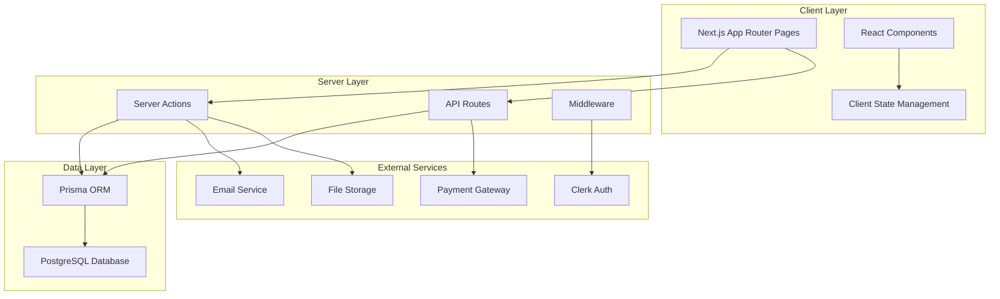
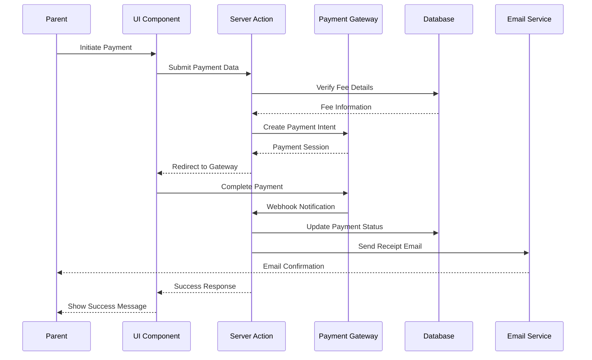
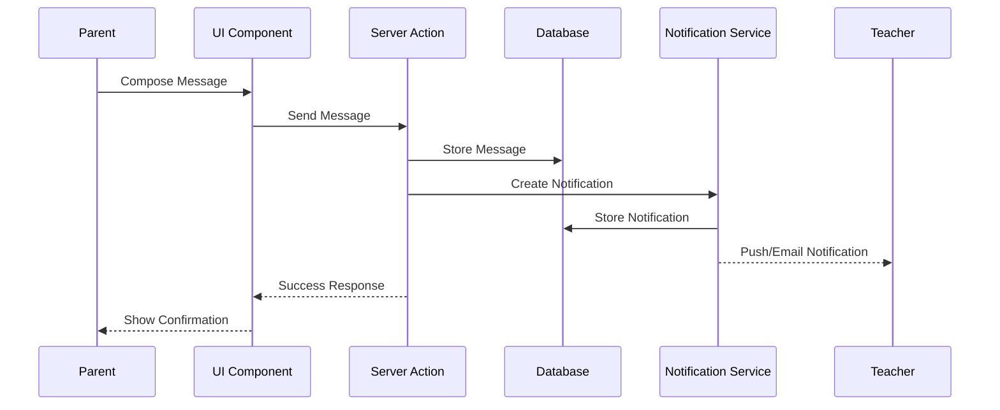

# Design Document

## Overview

This design document outlines the architecture and implementation approach for completing the Parent Dashboard to production-ready status. The system will build upon the existing Next.js 14 App Router architecture, Prisma ORM, and Clerk authentication infrastructure. The design focuses on implementing the missing 72% of features while maintaining consistency with existing patterns and ensuring scalability, security, and optimal user experience.

### Current State
- 28% of planned features implemented
- Core dashboard, children management, basic academics, and attendance tracking functional
- Existing authentication and database schema in place
- Component library (shadcn/ui) established

### Target State
- 100% feature-complete parent portal
- Production-ready with comprehensive error handling and security
- Optimized performance with caching and pagination
- Full payment gateway integration
- Real-time communication system
- Complete academic tracking and reporting

## Architecture

### High-Level Architecture



### Technology Stack

**Frontend:**
- Next.js 14+ (App Router)
- React 18+
- TypeScript
- Tailwind CSS
- shadcn/ui components
- date-fns for date manipulation
- Lucide React for icons

**Backend:**
- Next.js Server Actions
- Next.js API Routes
- Prisma ORM
- PostgreSQL database

**Authentication & Authorization:**
- Clerk for authentication
- Role-based access control (RBAC)
- Parent-child relationship verification

**External Integrations:**
- Payment Gateway (Razorpay)
- Email service (SendGrid)
- File storage (Cloudinary)

## Components and Interfaces

### Directory Structure

```
src/
├── app/
│   └── parent/
│       ├── fees/
│       │   ├── page.tsx (redirect to overview)
│       │   ├── overview/
│       │   │   └── page.tsx
│       │   ├── history/
│       │   │   └── page.tsx
│       │   └── payment/
│       │       ├── page.tsx
│       │       ├── success/
│       │       │   └── page.tsx
│       │       └── failed/
│       │           └── page.tsx
│       ├── communication/
│       │   ├── page.tsx (redirect to messages)
│       │   ├── messages/
│       │   │   └── page.tsx
│       │   ├── announcements/
│       │   │   └── page.tsx
│       │   └── notifications/
│       │       └── page.tsx
│       ├── performance/
│       │   ├── page.tsx (redirect to results)
│       │   ├── results/
│       │   │   └── page.tsx
│       │   └── reports/
│       │       └── page.tsx
│       ├── meetings/
│       │   ├── page.tsx (redirect to upcoming)
│       │   ├── schedule/
│       │   │   └── page.tsx
│       │   ├── upcoming/
│       │   │   └── page.tsx
│       │   └── history/
│       │       └── page.tsx
│       ├── academics/
│       │   ├── schedule/
│       │   │   └── page.tsx
│       │   ├── homework/
│       │   │   └── page.tsx
│       │   └── timetable/
│       │       └── page.tsx
│       ├── documents/
│       │   └── page.tsx
│       ├── events/
│       │   └── page.tsx
│       └── settings/
│           └── page.tsx
├── components/
│   └── parent/
│       ├── fees/
│       │   ├── fee-breakdown-card.tsx
│       │   ├── payment-history-table.tsx
│       │   ├── payment-form.tsx
│       │   └── payment-gateway-modal.tsx
│       ├── communication/
│       │   ├── message-list.tsx
│       │   ├── message-detail.tsx
│       │   ├── compose-message.tsx
│       │   ├── announcement-card.tsx
│       │   └── notification-list.tsx
│       ├── performance/
│       │   ├── exam-results-table.tsx
│       │   ├── performance-chart.tsx
│       │   ├── progress-report-card.tsx
│       │   └── grade-trend-chart.tsx
│       ├── meetings/
│       │   ├── meeting-schedule-form.tsx
│       │   ├── meeting-card.tsx
│       │   ├── teacher-availability-calendar.tsx
│       │   └── meeting-detail-modal.tsx
│       ├── academics/
│       │   ├── timetable-grid.tsx
│       │   ├── homework-list.tsx
│       │   ├── assignment-detail-card.tsx
│       │   └── academic-progress-tracker.tsx
│       ├── documents/
│       │   ├── document-grid.tsx
│       │   ├── document-card.tsx
│       │   └── document-preview-modal.tsx
│       ├── events/
│       │   ├── event-calendar.tsx
│       │   ├── event-card.tsx
│       │   ├── event-detail-modal.tsx
│       │   └── event-registration-form.tsx
│       └── settings/
│           ├── profile-edit-form.tsx
│           ├── notification-preferences.tsx
│           ├── security-settings.tsx
│           └── avatar-upload.tsx
├── lib/
│   ├── actions/
│   │   ├── parent-fee-actions.ts
│   │   ├── parent-communication-actions.ts
│   │   ├── parent-performance-actions.ts
│   │   ├── parent-meeting-actions.ts
│   │   ├── parent-document-actions.ts
│   │   ├── parent-event-actions.ts
│   │   └── parent-settings-actions.ts
│   ├── utils/
│   │   ├── payment-gateway.ts
│   │   ├── email-service.ts
│   │   ├── file-upload.ts
│   │   └── pdf-generator.ts
│   └── validations/
│       ├── fee-schemas.ts
│       ├── communication-schemas.ts
│       ├── meeting-schemas.ts
│       └── settings-schemas.ts
└── types/
    ├── fees.ts
    ├── communication.ts
    ├── performance.ts
    ├── meetings.ts
    └── events.ts
```

### Core Component Patterns

#### 1. Page Components
All page components follow this pattern:
- Server-side data fetching using Prisma
- Authentication check via Clerk
- Parent-child relationship verification
- Error boundary wrapping
- Loading state handling

```typescript
// Example pattern
export default async function ParentFeePage() {
  const parent = await getCurrentParent();
  if (!parent) redirect("/login");
  
  const data = await fetchData(parent.id);
  
  return (
    <div className="h-full p-6 space-y-6">
      <PageHeader />
      <DataDisplay data={data} />
    </div>
  );
}
```

#### 2. Server Actions
All server actions follow this pattern:
- Authentication verification
- Input validation using Zod
- Parent-child relationship checks
- Database operations via Prisma
- Error handling with try-catch
- Path revalidation

```typescript
// Example pattern
export async function performAction(formData: FormData) {
  const parent = await getCurrentParent();
  if (!parent) return { success: false, message: "Unauthorized" };
  
  try {
    const validated = schema.parse(data);
    const result = await db.operation(validated);
    revalidatePath("/parent/...");
    return { success: true, data: result };
  } catch (error) {
    return { success: false, message: error.message };
  }
}
```

#### 3. Client Components
Client components use:
- React hooks for state management
- Form handling with controlled inputs
- Optimistic UI updates
- Toast notifications for feedback
- Loading states during async operations

## Data Models

### Existing Models (Utilized)
The following Prisma models are already defined and will be used:

- **User, Parent, Student, StudentParent**: User management and relationships
- **FeePayment, FeeStructure, FeeType**: Fee management
- **Message, Announcement, Notification**: Communication
- **ExamResult, ReportCard, GradeScale**: Performance tracking
- **ParentMeeting**: Meeting management
- **Assignment, AssignmentSubmission**: Academic work
- **Document, DocumentType**: Document management
- **Event, EventParticipant**: Event management
- **TimetableSlot, Timetable**: Schedule management

### New Models Required

#### ParentSettings Model
```prisma
model ParentSettings {
  id                          String   @id @default(cuid())
  parent                      Parent   @relation(fields: [parentId], references: [id], onDelete: Cascade)
  parentId                    String   @unique
  
  // Notification preferences
  emailNotifications          Boolean  @default(true)
  smsNotifications            Boolean  @default(false)
  pushNotifications           Boolean  @default(true)
  feeReminders                Boolean  @default(true)
  attendanceAlerts            Boolean  @default(true)
  examResultNotifications     Boolean  @default(true)
  announcementNotifications   Boolean  @default(true)
  meetingReminders            Boolean  @default(true)
  
  // Communication preferences
  preferredContactMethod      String   @default("EMAIL") // EMAIL, SMS, BOTH
  notificationFrequency       String   @default("IMMEDIATE") // IMMEDIATE, DAILY_DIGEST, WEEKLY_DIGEST
  
  // Privacy settings
  profileVisibility           String   @default("PRIVATE") // PUBLIC, PRIVATE
  
  // Appearance settings
  theme                       String   @default("LIGHT") // LIGHT, DARK, SYSTEM
  language                    String   @default("en")
  
  createdAt                   DateTime @default(now())
  updatedAt                   DateTime @updatedAt
}
```

### Data Flow Diagrams

#### Fee Payment Flow


#### Communication Flow


## Error Handling

### Error Handling Strategy

#### 1. Client-Side Error Handling
- Form validation errors displayed inline
- Network errors shown with retry option
- Toast notifications for user feedback
- Error boundaries for component crashes

```typescript
// Error boundary pattern
export default function ErrorBoundary({
  error,
  reset,
}: {
  error: Error;
  reset: () => void;
}) {
  return (
    <div className="flex flex-col items-center justify-center h-full">
      <h2>Something went wrong!</h2>
      <p>{error.message}</p>
      <button onClick={reset}>Try again</button>
    </div>
  );
}
```

#### 2. Server-Side Error Handling
- Try-catch blocks in all server actions
- Zod validation for input data
- Database error handling
- Logging for debugging

```typescript
// Server action error handling pattern
try {
  const validated = schema.parse(data);
  const result = await db.operation(validated);
  return { success: true, data: result };
} catch (error) {
  if (error instanceof z.ZodError) {
    return { success: false, message: error.errors[0].message };
  }
  console.error("Operation failed:", error);
  return { success: false, message: "Operation failed" };
}
```

#### 3. API Route Error Handling
- HTTP status codes for different error types
- Structured error responses
- Rate limiting errors
- Authentication errors

```typescript
// API route error handling pattern
export async function POST(req: Request) {
  try {
    const data = await req.json();
    const result = await processData(data);
    return Response.json({ success: true, data: result });
  } catch (error) {
    return Response.json(
      { success: false, message: error.message },
      { status: 500 }
    );
  }
}
```

### Error Types and Responses

| Error Type | HTTP Status | User Message | Action |
|------------|-------------|--------------|--------|
| Validation Error | 400 | "Please check your input" | Show field errors |
| Authentication Error | 401 | "Please log in again" | Redirect to login |
| Authorization Error | 403 | "You don't have permission" | Show error page |
| Not Found Error | 404 | "Resource not found" | Show 404 page |
| Payment Error | 402 | "Payment failed" | Retry option |
| Server Error | 500 | "Something went wrong" | Retry option |
| Rate Limit Error | 429 | "Too many requests" | Wait message |

## Testing Strategy

### Testing Approach

#### 1. Unit Testing
- Test server actions with mock database
- Test utility functions
- Test validation schemas
- Test data transformations

**Tools:** Jest, Vitest

```typescript
// Example unit test
describe('getFeeOverview', () => {
  it('should return fee overview for valid parent', async () => {
    const result = await getFeeOverview('parent-id', 'child-id');
    expect(result.success).toBe(true);
    expect(result.data).toHaveProperty('totalFees');
  });
});
```

#### 2. Integration Testing
- Test complete user flows
- Test payment gateway integration
- Test email service integration
- Test file upload functionality

**Tools:** Playwright, Cypress

```typescript
// Example integration test
test('parent can pay fees', async ({ page }) => {
  await page.goto('/parent/fees/payment');
  await page.fill('[name="amount"]', '1000');
  await page.click('button[type="submit"]');
  await expect(page).toHaveURL('/parent/fees/payment/success');
});
```

#### 3. End-to-End Testing
- Test critical user journeys
- Test across different browsers
- Test responsive design
- Test accessibility

**Tools:** Playwright

#### 4. Manual Testing Checklist
- [ ] All pages load correctly
- [ ] Forms validate properly
- [ ] Payments process successfully
- [ ] Emails are sent
- [ ] Files upload and download
- [ ] Notifications appear
- [ ] Mobile responsiveness works
- [ ] Accessibility standards met

### Test Coverage Goals
- Server actions: 80%+ coverage
- Utility functions: 90%+ coverage
- Critical flows: 100% coverage
- Components: 70%+ coverage

## Security Considerations

### Authentication & Authorization

#### 1. Authentication Flow
- Clerk handles user authentication
- Session management via Clerk
- Automatic token refresh
- Secure cookie storage

#### 2. Authorization Checks
```typescript
// Parent-child relationship verification
async function verifyParentChildRelationship(
  parentId: string,
  childId: string
): Promise<boolean> {
  const relationship = await db.studentParent.findFirst({
    where: { parentId, studentId: childId }
  });
  return !!relationship;
}
```

#### 3. Role-Based Access Control
- Middleware checks user role
- Server actions verify parent role
- Database queries filtered by parent ID
- API routes protected with auth checks

### Data Security

#### 1. Input Validation
- Zod schemas for all inputs
- Sanitization of user input
- SQL injection prevention via Prisma
- XSS prevention via React

#### 2. Data Encryption
- HTTPS for all communications
- Encrypted database connections
- Secure password storage (Clerk)
- Encrypted file storage

#### 3. CSRF Protection
- CSRF tokens on all forms
- SameSite cookie attribute
- Origin validation on API routes

#### 4. Rate Limiting
```typescript
// Rate limiting implementation
import { Ratelimit } from "@upstash/ratelimit";
import { Redis } from "@upstash/redis";

const ratelimit = new Ratelimit({
  redis: Redis.fromEnv(),
  limiter: Ratelimit.slidingWindow(10, "10 s"),
});

export async function POST(req: Request) {
  const ip = req.headers.get("x-forwarded-for") ?? "127.0.0.1";
  const { success } = await ratelimit.limit(ip);
  
  if (!success) {
    return Response.json(
      { error: "Too many requests" },
      { status: 429 }
    );
  }
  
  // Process request
}
```

### Payment Security

#### 1. Payment Gateway Integration
- Never store card details
- Use tokenization
- PCI DSS compliance via gateway
- Webhook signature verification

#### 2. Transaction Security
- Idempotency keys for payments
- Transaction logging
- Fraud detection
- Refund handling

### File Upload Security

#### 1. File Validation
- File type validation
- File size limits (5MB for avatars, 10MB for attachments)
- Virus scanning
- Secure file naming

#### 2. Storage Security
- Signed URLs for downloads
- Access control on storage
- Automatic file expiration
- Backup and recovery

## Performance Optimization

### Database Optimization

#### 1. Query Optimization
- Use Prisma select to fetch only needed fields
- Implement pagination for large datasets
- Use database indexes on frequently queried fields
- Batch queries where possible

```typescript
// Optimized query example
const children = await db.student.findMany({
  where: {
    parents: {
      some: { parentId: parent.id }
    }
  },
  select: {
    id: true,
    user: {
      select: {
        firstName: true,
        lastName: true,
        avatar: true
      }
    },
    enrollments: {
      take: 1,
      orderBy: { enrollDate: 'desc' },
      select: {
        class: { select: { name: true } },
        section: { select: { name: true } }
      }
    }
  },
  take: 50, // Pagination
  skip: page * 50
});
```

#### 2. Caching Strategy
- Cache frequently accessed data
- Use React Server Components for automatic caching
- Implement stale-while-revalidate pattern
- Cache static content with CDN

```typescript
// Caching with Next.js
export const revalidate = 3600; // Revalidate every hour

export async function getData() {
  const data = await fetch('...', {
    next: { revalidate: 3600 }
  });
  return data;
}
```

#### 3. Database Indexes
```prisma
// Add indexes to frequently queried fields
model StudentParent {
  @@index([parentId])
  @@index([studentId])
}

model FeePayment {
  @@index([studentId])
  @@index([paymentDate])
}

model Message {
  @@index([recipientId, isRead])
}
```

### Frontend Optimization

#### 1. Code Splitting
- Dynamic imports for large components
- Route-based code splitting (automatic with App Router)
- Lazy loading for modals and dialogs

```typescript
// Dynamic import example
const PaymentGatewayModal = dynamic(
  () => import('@/components/parent/fees/payment-gateway-modal'),
  { loading: () => <LoadingSpinner /> }
);
```

#### 2. Image Optimization
- Use Next.js Image component
- Lazy loading images
- Responsive images
- WebP format with fallbacks

```typescript
<Image
  src={avatar}
  alt="Child avatar"
  width={100}
  height={100}
  loading="lazy"
  placeholder="blur"
/>
```

#### 3. Bundle Optimization
- Tree shaking unused code
- Minimize third-party dependencies
- Use production builds
- Analyze bundle size

### Loading States

#### 1. Skeleton Loaders
```typescript
// Skeleton component
export function FeeOverviewSkeleton() {
  return (
    <div className="space-y-4">
      <Skeleton className="h-32 w-full" />
      <Skeleton className="h-64 w-full" />
    </div>
  );
}
```

#### 2. Suspense Boundaries
```typescript
<Suspense fallback={<FeeOverviewSkeleton />}>
  <FeeOverview />
</Suspense>
```

#### 3. Progressive Enhancement
- Show cached data immediately
- Update with fresh data in background
- Optimistic UI updates

## External Service Integration

### Payment Gateway Integration

#### Razorpay Integration
```typescript
// lib/utils/payment-gateway.ts
import Razorpay from 'razorpay';
import crypto from 'crypto';

const razorpay = new Razorpay({
  key_id: process.env.RAZORPAY_KEY_ID!,
  key_secret: process.env.RAZORPAY_KEY_SECRET!,
});

export async function createPaymentOrder(
  amount: number,
  currency: string = 'INR',
  receipt: string
) {
  const order = await razorpay.orders.create({
    amount: amount * 100, // Convert to paise
    currency,
    receipt,
    payment_capture: 1, // Auto capture
  });
  
  return order;
}

export async function verifyPaymentSignature(
  orderId: string,
  paymentId: string,
  signature: string
): boolean {
  const text = `${orderId}|${paymentId}`;
  const generated_signature = crypto
    .createHmac('sha256', process.env.RAZORPAY_KEY_SECRET!)
    .update(text)
    .digest('hex');
  
  return generated_signature === signature;
}
```

### Email Service Integration

#### SendGrid Integration
```typescript
// lib/utils/email-service.ts
import sgMail from '@sendgrid/mail';

sgMail.setApiKey(process.env.SENDGRID_API_KEY!);

export async function sendPaymentReceipt(
  to: string,
  receiptData: ReceiptData
) {
  const msg = {
    to,
    from: process.env.SENDGRID_FROM_EMAIL!,
    subject: 'Payment Receipt',
    html: generateReceiptHTML(receiptData),
  };
  
  await sgMail.send(msg);
}

export async function sendMeetingConfirmation(
  to: string,
  meetingData: MeetingData
) {
  const msg = {
    to,
    from: process.env.SENDGRID_FROM_EMAIL!,
    subject: 'Meeting Confirmation',
    html: generateMeetingHTML(meetingData),
  };
  
  await sgMail.send(msg);
}
```

### File Storage Integration

#### Cloudinary Integration
```typescript
// lib/utils/file-upload.ts
import { v2 as cloudinary } from 'cloudinary';

cloudinary.config({
  cloud_name: process.env.CLOUDINARY_CLOUD_NAME,
  api_key: process.env.CLOUDINARY_API_KEY,
  api_secret: process.env.CLOUDINARY_API_SECRET,
});

export async function uploadFile(
  file: File,
  folder: string
): Promise<string> {
  const buffer = await file.arrayBuffer();
  const base64 = Buffer.from(buffer).toString('base64');
  const dataURI = `data:${file.type};base64,${base64}`;
  
  const result = await cloudinary.uploader.upload(dataURI, {
    folder,
    resource_type: 'auto',
    public_id: `${Date.now()}-${file.name.split('.')[0]}`,
  });
  
  return result.secure_url;
}

export async function deleteFile(publicId: string): Promise<void> {
  await cloudinary.uploader.destroy(publicId);
}
```

## Deployment Considerations

### Environment Variables
```env
# Database
DATABASE_URL=

# Authentication
NEXT_PUBLIC_CLERK_PUBLISHABLE_KEY=
CLERK_SECRET_KEY=

# Payment Gateway (Razorpay)
RAZORPAY_KEY_ID=
RAZORPAY_KEY_SECRET=
NEXT_PUBLIC_RAZORPAY_KEY_ID=

# Email Service (SendGrid)
SENDGRID_API_KEY=
SENDGRID_FROM_EMAIL=

# File Storage (Cloudinary)
CLOUDINARY_CLOUD_NAME=
CLOUDINARY_API_KEY=
CLOUDINARY_API_SECRET=

# Application
NEXT_PUBLIC_APP_URL=
```

### Build Configuration
```javascript
// next.config.js
module.exports = {
  images: {
    domains: ['res.cloudinary.com'],
  },
  experimental: {
    serverActions: true,
  },
};
```

### Monitoring and Logging
- Error tracking with Sentry
- Performance monitoring
- Database query monitoring
- API endpoint monitoring
- User analytics

## Accessibility

### WCAG 2.1 AA Compliance

#### 1. Keyboard Navigation
- All interactive elements keyboard accessible
- Logical tab order
- Skip navigation links
- Focus indicators visible

#### 2. Screen Reader Support
- Semantic HTML elements
- ARIA labels where needed
- Alt text for images
- Form labels properly associated

#### 3. Color Contrast
- Minimum 4.5:1 contrast ratio for text
- 3:1 for large text
- Color not sole indicator of information

#### 4. Responsive Design
- Mobile-friendly layouts
- Touch targets minimum 44x44px
- Zoom support up to 200%
- No horizontal scrolling

## Migration Strategy

### Phased Rollout

#### Phase 1: Critical Features (Weeks 1-4)
1. Fee management system
2. Communication system
3. Performance tracking

#### Phase 2: Important Features (Weeks 5-7)
1. Meeting management
2. Academic completion
3. Settings and profile

#### Phase 3: Additional Features (Weeks 8-9)
1. Documents management
2. Events management
3. Children section completion

#### Phase 4: Polish and Launch (Week 10)
1. Testing and bug fixes
2. Performance optimization
3. Documentation
4. Production deployment

### Backward Compatibility
- Existing features remain functional
- Database migrations non-destructive
- Gradual feature rollout
- Feature flags for new functionality

## Conclusion

This design provides a comprehensive blueprint for completing the Parent Dashboard to production-ready status. The architecture leverages existing patterns and infrastructure while introducing new features in a scalable, secure, and performant manner. The phased approach ensures continuous delivery of value while maintaining system stability.

Key success factors:
- Consistent patterns across all features
- Comprehensive error handling and security
- Performance optimization from the start
- Thorough testing at all levels
- Clear documentation and maintainability
