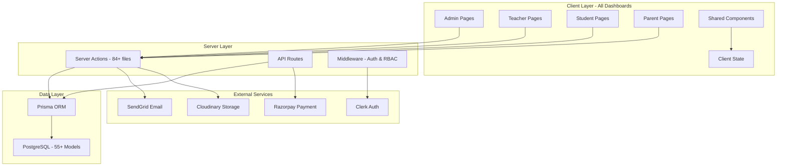
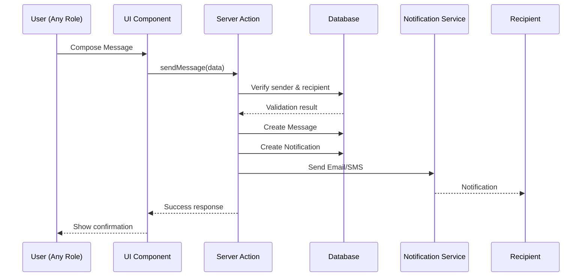

# Design Document

## Overview

This design document outlines the architecture and implementation approach for completing the School ERP system to production-ready status. The system will build upon the existing Next.js 14 App Router architecture, Prisma ORM, Clerk authentication, and shadcn/ui component library. The design focuses on completing the missing 24% of features while maintaining strict consistency with existing patterns, ensuring scalability, security, optimal performance, and a cohesive user experience across all dashboards.

### Current State
- **Overall Completion:** 76% (140/183 pages)
- **Admin Dashboard:** 81% complete (54/67 pages)
- **Teacher Dashboard:** 89% complete (32/36 pages)
- **Student Dashboard:** 98% complete (44/45 pages)
- **Parent Dashboard:** 29% complete (10/35 pages)
- **Existing Infrastructure:** Authentication, database schema, component library, 84 server actions, 150+ components

### Target State
- **Overall Completion:** 100% production-ready
- **All Dashboards:** Feature-complete with real database integration
- **Communication System:** Fully functional across all roles
- **Settings:** Complete for all user types
- **Performance:** Optimized with caching, pagination, and lazy loading
- **Security:** Production-grade with CSRF protection, rate limiting, input sanitization
- **Testing:** Comprehensive test coverage
- **Documentation:** Complete technical and user documentation
- **Deployment:** Production-ready with monitoring and error tracking

## Architecture

### High-Level Architecture



### Technology Stack (Existing - No Changes)

**Frontend:**
- Next.js 14+ (App Router)
- React 18+
- TypeScript
- Tailwind CSS
- shadcn/ui components
- date-fns
- Lucide React icons
- React Hook Form
- Zod validation

**Backend:**
- Next.js Server Actions
- Next.js API Routes
- Prisma ORM
- PostgreSQL

**Authentication:**
- Clerk
- Role-based access control (RBAC)

**External Services:**
- Razorpay (Payment Gateway)
- SendGrid (Email Service)
- Cloudinary (File Storage)

## Components and Interfaces

### Design System Consistency

All new components MUST follow the existing design patterns:

#### Component Structure Pattern
```typescript
// Existing pattern used throughout the project
import { Card, CardContent, CardHeader, CardTitle } from "@/components/ui/card";
import { Button } from "@/components/ui/button";

export function ExampleComponent() {
  return (
    <Card>
      <CardHeader>
        <CardTitle>Title</CardTitle>
      </CardHeader>
      <CardContent>
        {/* Content */}
      </CardContent>
    </Card>
  );
}
```

#### Color Scheme (Existing - Must Maintain)
- **Primary:** Blue (#3B82F6) - Used for primary actions
- **Success:** Green (#10B981) - Used for success states
- **Warning:** Amber (#F59E0B) - Used for warnings
- **Danger:** Red (#EF4444) - Used for errors/destructive actions
- **Gray Scale:** For text and backgrounds
- **Background:** White/Gray-50 for light theme

#### Typography (Existing - Must Maintain)
- **Headings:** font-semibold or font-bold
- **Body:** font-normal
- **Small Text:** text-sm or text-xs
- **Muted Text:** text-muted-foreground

#### Spacing (Existing - Must Maintain)
- **Page Padding:** p-6
- **Section Spacing:** space-y-6
- **Card Spacing:** p-4 or p-6
- **Grid Gaps:** gap-4 or gap-6

### Directory Structure for New Components

```
src/
├── app/
│   ├── admin/
│   │   ├── settings/
│   │   │   └── page.tsx (enhance existing)
│   │   └── page.tsx (enhance dashboard)
│   ├── teacher/
│   │   ├── communication/
│   │   │   ├── messages/
│   │   │   │   └── page.tsx (new)
│   │   │   └── announcements/
│   │   │       └── page.tsx (new)
│   │   ├── profile/
│   │   │   └── page.tsx (enhance existing)
│   │   ├── settings/
│   │   │   └── page.tsx (new)
│   │   └── page.tsx (enhance dashboard)
│   ├── student/
│   │   └── communication/
│   │       ├── messages/
│   │       │   └── page.tsx (new)
│   │       ├── announcements/
│   │       │   └── page.tsx (new)
│   │       └── notifications/
│   │           └── page.tsx (new)
│   └── parent/
│       ├── meetings/
│       │   ├── schedule/
│       │   │   └── page.tsx (new)
│       │   ├── upcoming/
│       │   │   └── page.tsx (new)
│       │   └── history/
│       │       └── page.tsx (new)
│       └── settings/
│           └── page.tsx (new)
├── components/
│   ├── admin/
│   │   ├── settings/
│   │   │   ├── school-info-form.tsx (new)
│   │   │   ├── academic-settings-form.tsx (new)
│   │   │   ├── notification-settings-form.tsx (new)
│   │   │   └── security-settings-form.tsx (new)
│   │   └── dashboard/
│   │       └── stats-cards.tsx (enhance)
│   ├── teacher/
│   │   ├── communication/
│   │   │   ├── message-list.tsx (new)
│   │   │   ├── compose-message.tsx (new)
│   │   │   └── announcement-list.tsx (new)
│   │   ├── profile/
│   │   │   └── profile-edit-form.tsx (new)
│   │   └── settings/
│   │       ├── notification-preferences.tsx (new)
│   │       └── appearance-settings.tsx (new)
│   ├── student/
│   │   └── communication/
│   │       ├── message-list.tsx (new)
│   │       ├── announcement-list.tsx (new)
│   │       └── notification-list.tsx (new)
│   ├── parent/
│   │   ├── meetings/
│   │   │   ├── meeting-schedule-form.tsx (new)
│   │   │   ├── meeting-card.tsx (new)
│   │   │   └── teacher-availability-calendar.tsx (new)
│   │   └── settings/
│   │       ├── profile-edit-form.tsx (new)
│   │       ├── notification-preferences.tsx (new)
│   │       └── avatar-upload.tsx (new)
│   └── shared/
│       └── loading/
│           ├── skeleton-card.tsx (new)
│           ├── skeleton-table.tsx (new)
│           └── skeleton-form.tsx (new)
└── lib/
    ├── actions/
    │   ├── teacher-communication-actions.ts (new)
    │   ├── teacher-profile-actions.ts (enhance)
    │   ├── teacher-settings-actions.ts (new)
    │   ├── student-communication-actions.ts (new)
    │   ├── parent-meeting-actions.ts (enhance)
    │   ├── parent-settings-actions.ts (enhance)
    │   └── admin-settings-actions.ts (enhance)
    └── validations/
        ├── teacher-schemas.ts (new)
        ├── student-schemas.ts (new)
        └── admin-schemas.ts (enhance)
```

## Data Models

### Existing Models (No Changes Required)

The following 55+ Prisma models are already defined and will be used:

**Core Models:**
- User, Administrator, Teacher, Student, Parent, StudentParent

**Academic Models:**
- AcademicYear, Term, Department, Class, ClassSection, ClassRoom, ClassTeacher, ClassEnrollment

**Subject & Teaching Models:**
- Subject, SubjectTeacher, SubjectClass, Syllabus, SyllabusUnit, Lesson

**Timetable Models:**
- Timetable, TimetableConfig, TimetablePeriod, TimetableSlot

**Assessment Models:**
- ExamType, Exam, ExamResult, GradeScale, Assignment, AssignmentClass, AssignmentSubmission, ReportCard

**Attendance Models:**
- StudentAttendance, TeacherAttendance, LeaveApplication

**Finance Models:**
- FeeType, FeeStructure, FeeStructureItem, FeePayment, Scholarship, ScholarshipRecipient, Expense, Budget, Payroll

**Communication Models:**
- Message, Announcement, Notification, ParentMeeting

**Document & Event Models:**
- DocumentType, Document, Event, EventParticipant

**Settings Models:**
- StudentSettings, ParentSettings (may need to add TeacherSettings, SystemSettings)

### New Models Required

#### TeacherSettings Model
```prisma
model TeacherSettings {
  id                          String   @id @default(cuid())
  teacher                     Teacher  @relation(fields: [teacherId], references: [id], onDelete: Cascade)
  teacherId                   String   @unique
  
  // Notification preferences
  emailNotifications          Boolean  @default(true)
  smsNotifications            Boolean  @default(false)
  pushNotifications           Boolean  @default(true)
  assignmentReminders         Boolean  @default(true)
  examReminders               Boolean  @default(true)
  messageNotifications        Boolean  @default(true)
  announcementNotifications   Boolean  @default(true)
  
  // Appearance settings
  theme                       String   @default("LIGHT") // LIGHT, DARK, SYSTEM
  colorTheme                  String   @default("blue") // blue, red, green, purple, orange, teal
  language                    String   @default("en")
  
  createdAt                   DateTime @default(now())
  updatedAt                   DateTime @updatedAt
  
  @@index([teacherId])
}
```

#### SystemSettings Model
```prisma
model SystemSettings {
  id                          String   @id @default(cuid())
  
  // School Information
  schoolName                  String
  schoolAddress               String?
  schoolPhone                 String?
  schoolEmail                 String?
  schoolLogo                  String?
  schoolWebsite               String?
  
  // Academic Settings
  defaultGradingScale         String   @default("PERCENTAGE") // PERCENTAGE, GPA, LETTER
  attendanceThreshold         Int      @default(75) // Minimum attendance percentage
  lateArrivalMinutes          Int      @default(15) // Minutes after which marked late
  
  // Notification Settings
  emailEnabled                Boolean  @default(true)
  smsEnabled                  Boolean  @default(false)
  pushEnabled                 Boolean  @default(true)
  
  // Security Settings
  sessionTimeout              Int      @default(30) // Minutes
  passwordMinLength           Int      @default(8)
  passwordRequireSpecialChar  Boolean  @default(true)
  passwordRequireNumber       Boolean  @default(true)
  passwordRequireUppercase    Boolean  @default(true)
  
  // Appearance Settings (Admin can set default for school)
  defaultTheme                String   @default("LIGHT") // LIGHT, DARK, SYSTEM
  defaultColorTheme           String   @default("blue") // blue, red, green, purple, orange, teal
  
  createdAt                   DateTime @default(now())
  updatedAt                   DateTime @updatedAt
}
```

**Note:** StudentSettings and ParentSettings models should also include the `colorTheme` field:

```prisma
// Add to existing StudentSettings model
colorTheme String @default("blue") // blue, red, green, purple, orange, teal

// Add to existing ParentSettings model  
colorTheme String @default("blue") // blue, red, green, purple, orange, teal
```

### Database Indexes for Performance

Add the following indexes to existing models:

```prisma
// Message model indexes
model Message {
  // ... existing fields
  @@index([recipientId, isRead])
  @@index([senderId])
  @@index([createdAt])
}

// Notification model indexes
model Notification {
  // ... existing fields
  @@index([userId, isRead])
  @@index([createdAt])
}

// FeePayment model indexes
model FeePayment {
  // ... existing fields
  @@index([studentId, paymentStatus])
  @@index([paymentDate])
}

// StudentAttendance model indexes
model StudentAttendance {
  // ... existing fields
  @@index([studentId, date])
  @@index([classId, date])
}

// ExamResult model indexes
model ExamResult {
  // ... existing fields
  @@index([studentId, examId])
  @@index([examId])
}
```

## Page Patterns and Loading States

### Standard Page Pattern

All pages MUST follow this pattern:

```typescript
// app/[role]/[section]/page.tsx
import { Suspense } from "react";
import { getCurrentUser } from "@/lib/auth";
import { redirect } from "next/navigation";
import { PageSkeleton } from "@/components/shared/loading/page-skeleton";

export default async function Page() {
  const user = await getCurrentUser();
  if (!user) redirect("/login");
  
  return (
    <div className="h-full p-6 space-y-6">
      <div className="flex items-center justify-between">
        <h1 className="text-3xl font-bold">Page Title</h1>
        {/* Action buttons */}
      </div>
      
      <Suspense fallback={<PageSkeleton />}>
        <PageContent />
      </Suspense>
    </div>
  );
}
```

### Loading State Pattern

Every page MUST have a loading.tsx file:

```typescript
// app/[role]/[section]/loading.tsx
import { Skeleton } from "@/components/ui/skeleton";

export default function Loading() {
  return (
    <div className="h-full p-6 space-y-6">
      <div className="flex items-center justify-between">
        <Skeleton className="h-10 w-64" />
        <Skeleton className="h-10 w-32" />
      </div>
      
      <div className="grid gap-6 md:grid-cols-2 lg:grid-cols-4">
        {[...Array(4)].map((_, i) => (
          <Skeleton key={i} className="h-32" />
        ))}
      </div>
      
      <Skeleton className="h-96" />
    </div>
  );
}
```

### Error Boundary Pattern

Every major section MUST have an error.tsx file:

```typescript
// app/[role]/[section]/error.tsx
"use client";

import { useEffect } from "react";
import { Button } from "@/components/ui/button";
import { AlertCircle } from "lucide-react";

export default function Error({
  error,
  reset,
}: {
  error: Error & { digest?: string };
  reset: () => void;
}) {
  useEffect(() => {
    console.error(error);
  }, [error]);

  return (
    <div className="flex h-full flex-col items-center justify-center space-y-4">
      <AlertCircle className="h-16 w-16 text-destructive" />
      <h2 className="text-2xl font-bold">Something went wrong!</h2>
      <p className="text-muted-foreground">{error.message}</p>
      <Button onClick={reset}>Try again</Button>
    </div>
  );
}
```

## Server Actions Pattern

All server actions MUST follow this pattern:

```typescript
"use server";

import { auth } from "@clerk/nextjs";
import { db } from "@/lib/db";
import { revalidatePath } from "next/cache";
import { z } from "zod";

// Define schema
const schema = z.object({
  field: z.string().min(1, "Field is required"),
});

export async function performAction(formData: FormData) {
  try {
    // 1. Authentication check
    const { userId } = auth();
    if (!userId) {
      return { success: false, message: "Unauthorized" };
    }

    // 2. Get user from database
    const user = await db.user.findUnique({
      where: { clerkId: userId },
      include: { teacher: true } // or student, parent, admin
    });

    if (!user || !user.teacher) {
      return { success: false, message: "User not found" };
    }

    // 3. Validate input
    const data = {
      field: formData.get("field") as string,
    };

    const validated = schema.parse(data);

    // 4. Perform database operation
    const result = await db.model.create({
      data: {
        ...validated,
        teacherId: user.teacher.id,
      },
    });

    // 5. Revalidate path
    revalidatePath("/teacher/section");

    // 6. Return success
    return { success: true, data: result };
  } catch (error) {
    // 7. Error handling
    if (error instanceof z.ZodError) {
      return { success: false, message: error.errors[0].message };
    }
    console.error("Action failed:", error);
    return { success: false, message: "Operation failed" };
  }
}
```

## Communication System Design

### Unified Communication Architecture

The communication system will be consistent across all roles with role-specific filtering:



### Message Component Structure

```typescript
// Shared message list component pattern
interface MessageListProps {
  role: "admin" | "teacher" | "student" | "parent";
  userId: string;
  type: "inbox" | "sent" | "drafts";
}

export function MessageList({ role, userId, type }: MessageListProps) {
  // Fetch messages based on role and type
  // Display in consistent format
  // Handle actions (read, delete, reply)
}
```

## Settings System Design

### Unified Settings Architecture

Settings will follow a consistent pattern across all roles:

```typescript
// Settings page structure (consistent across roles)
export default function SettingsPage() {
  return (
    <div className="h-full p-6 space-y-6">
      <h1 className="text-3xl font-bold">Settings</h1>
      
      <Tabs defaultValue="profile">
        <TabsList>
          <TabsTrigger value="profile">Profile</TabsTrigger>
          <TabsTrigger value="notifications">Notifications</TabsTrigger>
          <TabsTrigger value="security">Security</TabsTrigger>
          <TabsTrigger value="appearance">Appearance</TabsTrigger>
        </TabsList>
        
        <TabsContent value="profile">
          <ProfileEditForm />
        </TabsContent>
        
        <TabsContent value="notifications">
          <NotificationPreferences />
        </TabsContent>
        
        <TabsContent value="security">
          <SecuritySettings />
        </TabsContent>
        
        <TabsContent value="appearance">
          <AppearanceSettings />
        </TabsContent>
      </Tabs>
    </div>
  );
}
```

### Theme Customization System

All four dashboards (Admin, Teacher, Student, Parent) will support theme customization with color schemes:

```typescript
// Appearance Settings Component (shared across all roles)
export function AppearanceSettings() {
  return (
    <Card>
      <CardHeader>
        <CardTitle>Appearance</CardTitle>
        <CardDescription>
          Customize how the application looks for you
        </CardDescription>
      </CardHeader>
      <CardContent className="space-y-6">
        {/* Theme Mode Selection */}
        <div className="space-y-2">
          <Label>Theme Mode</Label>
          <RadioGroup defaultValue="light">
            <div className="flex items-center space-x-2">
              <RadioGroupItem value="light" id="light" />
              <Label htmlFor="light">Light</Label>
            </div>
            <div className="flex items-center space-x-2">
              <RadioGroupItem value="dark" id="dark" />
              <Label htmlFor="dark">Dark</Label>
            </div>
            <div className="flex items-center space-x-2">
              <RadioGroupItem value="system" id="system" />
              <Label htmlFor="system">System</Label>
            </div>
          </RadioGroup>
        </div>
        
        {/* Color Theme Selection */}
        <div className="space-y-2">
          <Label>Color Theme</Label>
          <div className="grid grid-cols-3 gap-3">
            {/* Blue Theme (Default) */}
            <button
              className="flex flex-col items-center gap-2 rounded-lg border-2 border-primary p-3"
            >
              <div className="h-12 w-12 rounded-full bg-blue-500" />
              <span className="text-sm font-medium">Blue</span>
            </button>
            
            {/* Red Theme */}
            <button
              className="flex flex-col items-center gap-2 rounded-lg border-2 border-transparent p-3 hover:border-muted"
            >
              <div className="h-12 w-12 rounded-full bg-red-500" />
              <span className="text-sm font-medium">Red</span>
            </button>
            
            {/* Green Theme */}
            <button
              className="flex flex-col items-center gap-2 rounded-lg border-2 border-transparent p-3 hover:border-muted"
            >
              <div className="h-12 w-12 rounded-full bg-green-500" />
              <span className="text-sm font-medium">Green</span>
            </button>
            
            {/* Purple Theme */}
            <button
              className="flex flex-col items-center gap-2 rounded-lg border-2 border-transparent p-3 hover:border-muted"
            >
              <div className="h-12 w-12 rounded-full bg-purple-500" />
              <span className="text-sm font-medium">Purple</span>
            </button>
            
            {/* Orange Theme */}
            <button
              className="flex flex-col items-center gap-2 rounded-lg border-2 border-transparent p-3 hover:border-muted"
            >
              <div className="h-12 w-12 rounded-full bg-orange-500" />
              <span className="text-sm font-medium">Orange</span>
            </button>
            
            {/* Teal Theme */}
            <button
              className="flex flex-col items-center gap-2 rounded-lg border-2 border-transparent p-3 hover:border-muted"
            >
              <div className="h-12 w-12 rounded-full bg-teal-500" />
              <span className="text-sm font-medium">Teal</span>
            </button>
          </div>
        </div>
        
        {/* Language Selection */}
        <div className="space-y-2">
          <Label>Language</Label>
          <Select defaultValue="en">
            <SelectTrigger>
              <SelectValue />
            </SelectTrigger>
            <SelectContent>
              <SelectItem value="en">English</SelectItem>
              <SelectItem value="hi">Hindi</SelectItem>
              <SelectItem value="es">Spanish</SelectItem>
              <SelectItem value="fr">French</SelectItem>
              <SelectItem value="ar">Arabic</SelectItem>
              <SelectItem value="zh">Chinese</SelectItem>
            </SelectContent>
          </Select>
        </div>
        
        <Button>Save Changes</Button>
      </CardContent>
    </Card>
  );
}
```

### Theme Provider Implementation

```typescript
// app/providers.tsx
"use client";

import { ThemeProvider } from "next-themes";

export function Providers({ children }: { children: React.ReactNode }) {
  return (
    <ThemeProvider
      attribute="class"
      defaultTheme="system"
      enableSystem
      disableTransitionOnChange
    >
      {children}
    </ThemeProvider>
  );
}
```

### Theme Toggle in Headers

Each dashboard header will include a theme toggle:

```typescript
// components/layout/[role]-header.tsx
import { Moon, Sun } from "lucide-react";
import { useTheme } from "next-themes";

export function RoleHeader() {
  const { theme, setTheme } = useTheme();
  
  return (
    <header>
      {/* Other header content */}
      
      <Button
        variant="ghost"
        size="icon"
        onClick={() => setTheme(theme === "dark" ? "light" : "dark")}
      >
        <Sun className="h-5 w-5 rotate-0 scale-100 transition-all dark:-rotate-90 dark:scale-0" />
        <Moon className="absolute h-5 w-5 rotate-90 scale-0 transition-all dark:rotate-0 dark:scale-100" />
        <span className="sr-only">Toggle theme</span>
      </Button>
    </header>
  );
}
```

### Color Theme CSS Variables

```css
/* globals.css - Color theme system */
@layer base {
  /* Default Blue Theme */
  :root {
    --background: 0 0% 100%;
    --foreground: 222.2 84% 4.9%;
    --primary: 221.2 83.2% 53.3%; /* Blue */
    --primary-foreground: 210 40% 98%;
    /* ... other variables */
  }
 
  .dark {
    --background: 222.2 84% 4.9%;
    --foreground: 210 40% 98%;
    --primary: 217.2 91.2% 59.8%; /* Blue */
    --primary-foreground: 222.2 47.4% 11.2%;
    /* ... other variables */
  }
  
  /* Red Theme */
  .theme-red {
    --primary: 0 84.2% 60.2%; /* Red */
    --primary-foreground: 0 0% 100%;
  }
  
  .dark.theme-red {
    --primary: 0 72.2% 50.6%; /* Red */
    --primary-foreground: 0 0% 100%;
  }
  
  /* Green Theme */
  .theme-green {
    --primary: 142.1 76.2% 36.3%; /* Green */
    --primary-foreground: 355.7 100% 97.3%;
  }
  
  .dark.theme-green {
    --primary: 142.1 70.6% 45.3%; /* Green */
    --primary-foreground: 144.9 80.4% 10%;
  }
  
  /* Purple Theme */
  .theme-purple {
    --primary: 262.1 83.3% 57.8%; /* Purple */
    --primary-foreground: 210 20% 98%;
  }
  
  .dark.theme-purple {
    --primary: 263.4 70% 50.4%; /* Purple */
    --primary-foreground: 210 20% 98%;
  }
  
  /* Orange Theme */
  .theme-orange {
    --primary: 24.6 95% 53.1%; /* Orange */
    --primary-foreground: 60 9.1% 97.8%;
  }
  
  .dark.theme-orange {
    --primary: 20.5 90.2% 48.2%; /* Orange */
    --primary-foreground: 60 9.1% 97.8%;
  }
  
  /* Teal Theme */
  .theme-teal {
    --primary: 173 80% 40%; /* Teal */
    --primary-foreground: 0 0% 100%;
  }
  
  .dark.theme-teal {
    --primary: 172.5 66% 50.4%; /* Teal */
    --primary-foreground: 0 0% 100%;
  }
}
```

### Theme Context Provider

```typescript
// lib/contexts/theme-context.tsx
"use client";

import { createContext, useContext, useEffect, useState } from "react";
import { useTheme } from "next-themes";

type ColorTheme = "blue" | "red" | "green" | "purple" | "orange" | "teal";

interface ThemeContextType {
  colorTheme: ColorTheme;
  setColorTheme: (theme: ColorTheme) => void;
}

const ThemeContext = createContext<ThemeContextType | undefined>(undefined);

export function ThemeContextProvider({ children }: { children: React.ReactNode }) {
  const [colorTheme, setColorThemeState] = useState<ColorTheme>("blue");

  useEffect(() => {
    // Load saved color theme from localStorage
    const saved = localStorage.getItem("color-theme") as ColorTheme;
    if (saved) {
      setColorThemeState(saved);
      document.documentElement.classList.add(`theme-${saved}`);
    }
  }, []);

  const setColorTheme = (theme: ColorTheme) => {
    // Remove old theme class
    document.documentElement.classList.remove(
      "theme-blue",
      "theme-red",
      "theme-green",
      "theme-purple",
      "theme-orange",
      "theme-teal"
    );
    
    // Add new theme class
    if (theme !== "blue") {
      document.documentElement.classList.add(`theme-${theme}`);
    }
    
    // Save to localStorage
    localStorage.setItem("color-theme", theme);
    setColorThemeState(theme);
  };

  return (
    <ThemeContext.Provider value={{ colorTheme, setColorTheme }}>
      {children}
    </ThemeContext.Provider>
  );
}

export function useColorTheme() {
  const context = useContext(ThemeContext);
  if (!context) {
    throw new Error("useColorTheme must be used within ThemeContextProvider");
  }
  return context;
}
```

## Error Handling Strategy

### Client-Side Error Handling

1. **Form Validation Errors:**
```typescript
// Using React Hook Form + Zod
const form = useForm({
  resolver: zodResolver(schema),
});

// Display errors inline
{form.formState.errors.field && (
  <p className="text-sm text-destructive">
    {form.formState.errors.field.message}
  </p>
)}
```

2. **Network Errors:**
```typescript
// Using toast notifications
import { toast } from "sonner";

try {
  const result = await action(data);
  if (result.success) {
    toast.success("Operation successful");
  } else {
    toast.error(result.message);
  }
} catch (error) {
  toast.error("Network error. Please try again.");
}
```

3. **Component Errors:**
```typescript
// Using error boundaries (error.tsx files)
// Automatically catch and display errors
```

### Server-Side Error Handling

1. **Validation Errors:**
```typescript
try {
  const validated = schema.parse(data);
} catch (error) {
  if (error instanceof z.ZodError) {
    return { success: false, message: error.errors[0].message };
  }
}
```

2. **Database Errors:**
```typescript
try {
  const result = await db.operation();
} catch (error) {
  console.error("Database error:", error);
  return { success: false, message: "Database operation failed" };
}
```

3. **Authorization Errors:**
```typescript
if (!user || !user.teacher) {
  return { success: false, message: "Unauthorized" };
}
```

## Performance Optimization

### Database Query Optimization

1. **Use Prisma Select:**
```typescript
// Only fetch needed fields
const students = await db.student.findMany({
  select: {
    id: true,
    user: {
      select: {
        firstName: true,
        lastName: true,
        avatar: true,
      },
    },
  },
});
```

2. **Implement Pagination:**
```typescript
// Cursor-based pagination
const PAGE_SIZE = 50;

const items = await db.model.findMany({
  take: PAGE_SIZE,
  skip: page * PAGE_SIZE,
  orderBy: { createdAt: "desc" },
});
```

3. **Use Database Indexes:**
```prisma
// Add indexes to frequently queried fields
@@index([userId, createdAt])
@@index([status])
```

### Frontend Optimization

1. **Code Splitting:**
```typescript
// Dynamic imports for large components
const HeavyComponent = dynamic(
  () => import("@/components/heavy-component"),
  { loading: () => <Skeleton /> }
);
```

2. **Image Optimization:**
```typescript
// Use Next.js Image component
import Image from "next/image";

<Image
  src={avatar}
  alt="Avatar"
  width={100}
  height={100}
  loading="lazy"
/>
```

3. **Caching:**
```typescript
// Use Next.js caching
export const revalidate = 3600; // Revalidate every hour

// Or fetch with cache
const data = await fetch(url, {
  next: { revalidate: 3600 }
});
```

## Security Implementation

### CSRF Protection

```typescript
// Add CSRF token to forms
import { CSRFInput } from "@/components/security/csrf-input";

<form action={action}>
  <CSRFInput />
  {/* form fields */}
</form>
```

### Rate Limiting

```typescript
// Implement rate limiting on API routes
import { Ratelimit } from "@upstash/ratelimit";
import { Redis } from "@upstash/redis";

const ratelimit = new Ratelimit({
  redis: Redis.fromEnv(),
  limiter: Ratelimit.slidingWindow(10, "10 s"),
});

export async function POST(req: Request) {
  const ip = req.headers.get("x-forwarded-for") ?? "127.0.0.1";
  const { success } = await ratelimit.limit(ip);
  
  if (!success) {
    return Response.json(
      { error: "Too many requests" },
      { status: 429 }
    );
  }
  
  // Process request
}
```

### Input Sanitization

```typescript
// Sanitize all user inputs
import { sanitizeInput } from "@/lib/utils/input-sanitization";

const sanitized = sanitizeInput(userInput);
```

## Testing Strategy

### Unit Testing

Test server actions with mock database:

```typescript
// __tests__/actions/teacher-actions.test.ts
import { describe, it, expect, vi } from "vitest";
import { sendMessage } from "@/lib/actions/teacher-communication-actions";

vi.mock("@/lib/db");

describe("sendMessage", () => {
  it("should send message successfully", async () => {
    const result = await sendMessage(mockData);
    expect(result.success).toBe(true);
  });
  
  it("should fail with invalid data", async () => {
    const result = await sendMessage(invalidData);
    expect(result.success).toBe(false);
  });
});
```

### Integration Testing

Test complete user flows:

```typescript
// __tests__/integration/communication.test.ts
import { test, expect } from "@playwright/test";

test("teacher can send message to parent", async ({ page }) => {
  await page.goto("/teacher/communication/messages");
  await page.click('button:has-text("Compose")');
  await page.fill('[name="recipient"]', 'parent@example.com');
  await page.fill('[name="subject"]', 'Test Subject');
  await page.fill('[name="body"]', 'Test Message');
  await page.click('button[type="submit"]');
  await expect(page.locator('text=Message sent')).toBeVisible();
});
```

### Manual Testing Checklist

- [ ] All pages load without errors
- [ ] Forms validate correctly
- [ ] Success/error messages display
- [ ] Loading states show properly
- [ ] Mobile responsive design works
- [ ] Keyboard navigation works
- [ ] Screen reader accessibility
- [ ] Cross-browser compatibility

## Deployment Strategy

### Environment Configuration

```env
# Production environment variables
DATABASE_URL=postgresql://...
NEXT_PUBLIC_CLERK_PUBLISHABLE_KEY=pk_live_...
CLERK_SECRET_KEY=sk_live_...
RAZORPAY_KEY_ID=rzp_live_...
RAZORPAY_KEY_SECRET=...
SENDGRID_API_KEY=SG....
CLOUDINARY_CLOUD_NAME=...
CLOUDINARY_API_KEY=...
CLOUDINARY_API_SECRET=...
NEXT_PUBLIC_APP_URL=https://yourdomain.com
SENTRY_DSN=https://...
```

### Deployment Checklist

1. **Pre-Deployment:**
   - [ ] Run all tests
   - [ ] Fix TypeScript errors
   - [ ] Fix ESLint warnings
   - [ ] Run database migrations
   - [ ] Update environment variables
   - [ ] Build production bundle
   - [ ] Test production build locally

2. **Deployment:**
   - [ ] Deploy to hosting platform (Vercel/AWS/etc.)
   - [ ] Configure CDN for static assets
   - [ ] Set up SSL certificate
   - [ ] Configure custom domain
   - [ ] Set up error tracking (Sentry)
   - [ ] Set up monitoring (Vercel Analytics)

3. **Post-Deployment:**
   - [ ] Verify all pages load
   - [ ] Test critical user flows
   - [ ] Monitor error logs
   - [ ] Check performance metrics
   - [ ] Set up backup procedures

## Monitoring and Logging

### Error Tracking

```typescript
// Configure Sentry
import * as Sentry from "@sentry/nextjs";

Sentry.init({
  dsn: process.env.SENTRY_DSN,
  environment: process.env.NODE_ENV,
  tracesSampleRate: 1.0,
});
```

### Performance Monitoring

```typescript
// Monitor slow queries
export async function monitoredQuery<T>(
  queryFn: () => Promise<T>,
  queryName: string
): Promise<T> {
  const start = Date.now();
  const result = await queryFn();
  const duration = Date.now() - start;
  
  if (duration > 1000) {
    console.warn(`Slow query: ${queryName} took ${duration}ms`);
  }
  
  return result;
}
```

## Accessibility Guidelines

### WCAG 2.1 AA Compliance

1. **Keyboard Navigation:**
   - All interactive elements must be keyboard accessible
   - Logical tab order
   - Visible focus indicators

2. **Screen Reader Support:**
   - Semantic HTML elements
   - ARIA labels where needed
   - Alt text for images
   - Form labels properly associated

3. **Color Contrast:**
   - Minimum 4.5:1 for normal text
   - Minimum 3:1 for large text
   - Color not sole indicator

4. **Responsive Design:**
   - Mobile-friendly layouts
   - Touch targets minimum 44x44px
   - Zoom support up to 200%

## Documentation Requirements

### Technical Documentation

1. **Architecture Documentation:**
   - System overview
   - Component structure
   - Data flow diagrams
   - API documentation

2. **Development Documentation:**
   - Setup instructions
   - Development workflow
   - Coding standards
   - Testing guidelines

3. **Deployment Documentation:**
   - Environment setup
   - Deployment process
   - Rollback procedures
   - Troubleshooting guide

### User Documentation

1. **Admin User Manual:**
   - Dashboard overview
   - User management
   - Settings configuration
   - Reports generation

2. **Teacher User Manual:**
   - Dashboard overview
   - Class management
   - Assessment creation
   - Communication tools

3. **Student User Manual:**
   - Dashboard overview
   - Assignment submission
   - Grade viewing
   - Communication tools

4. **Parent User Manual:**
   - Dashboard overview
   - Fee payment
   - Meeting scheduling
   - Performance tracking

## Conclusion

This design provides a comprehensive blueprint for completing the School ERP system to production-ready status. The architecture maintains strict consistency with existing patterns while introducing new features in a scalable, secure, and performant manner. All new components will follow the established design system, ensuring a cohesive user experience across all dashboards.

Key success factors:
- **Consistency:** All new code follows existing patterns
- **Design System:** Strict adherence to shadcn/ui and Tailwind CSS
- **Performance:** Optimized from the start with caching and pagination
- **Security:** Production-grade security measures
- **Testing:** Comprehensive test coverage
- **Documentation:** Complete technical and user documentation
- **Accessibility:** WCAG 2.1 AA compliance
- **Maintainability:** Clean, well-documented code
