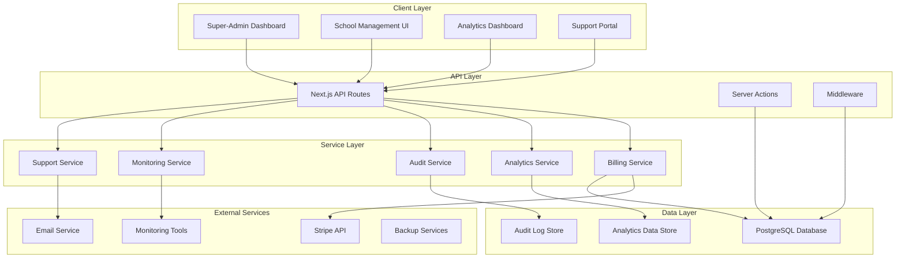
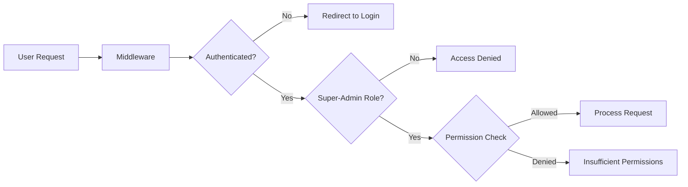

# Design Document: Super-Admin SaaS Completion

## Overview

The super-admin SaaS completion project transforms the existing basic multi-tenant dashboard into a comprehensive SaaS platform control center. The design leverages Next.js 14+ App Router architecture with server-side rendering, Prisma ORM for database operations, and integrates multiple third-party services including Stripe for billing, monitoring solutions for system health, and audit logging systems for compliance.

The architecture follows a modular approach with clear separation of concerns, implementing role-based access control, comprehensive audit trails, and real-time monitoring capabilities. The system maintains the existing multi-tenant foundation while adding enterprise-grade features for billing management, advanced analytics, and operational control.

## Architecture

### High-Level Architecture



### Multi-Tenant Architecture Enhancement

The existing multi-tenant architecture is enhanced with additional isolation layers and security controls:

- **Data Isolation**: Enhanced tenant data separation with row-level security
- **Resource Isolation**: Per-tenant resource quotas and usage tracking
- **Security Isolation**: Tenant-specific security policies and audit trails
- **Performance Isolation**: Query optimization and caching strategies per tenant

### Authentication and Authorization



## Components and Interfaces

### Core Service Components

#### BillingService
Manages all billing operations including Stripe integration, invoice generation, and payment processing.

**Interface:**
```typescript
interface BillingService {
  createSubscription(schoolId: string, planId: string): Promise<Subscription>
  updateSubscription(subscriptionId: string, changes: SubscriptionUpdate): Promise<Subscription>
  processPayment(paymentData: PaymentData): Promise<PaymentResult>
  generateInvoice(subscriptionId: string): Promise<Invoice>
  handleWebhook(webhookData: StripeWebhook): Promise<void>
  getPaymentHistory(schoolId: string): Promise<PaymentHistory[]>
  processRefund(paymentId: string, amount?: number): Promise<RefundResult>
}
```

#### AnalyticsService
Provides comprehensive analytics and business intelligence capabilities.

**Interface:**
```typescript
interface AnalyticsService {
  getRevenueMetrics(timeRange: TimeRange): Promise<RevenueMetrics>
  getChurnAnalysis(timeRange: TimeRange): Promise<ChurnAnalysis>
  getUsageAnalytics(schoolId?: string): Promise<UsageAnalytics>
  generateCustomReport(reportConfig: ReportConfig): Promise<Report>
  getKPIDashboard(): Promise<KPIDashboard>
  exportData(exportConfig: ExportConfig): Promise<ExportResult>
}
```

#### AuditService
Handles comprehensive audit logging and compliance reporting.

**Interface:**
```typescript
interface AuditService {
  logAction(action: AuditAction): Promise<void>
  getAuditLogs(filters: AuditFilters): Promise<AuditLog[]>
  generateComplianceReport(reportType: ComplianceType): Promise<ComplianceReport>
  verifyLogIntegrity(logId: string): Promise<IntegrityResult>
  exportAuditData(exportConfig: AuditExportConfig): Promise<ExportResult>
}
```

#### MonitoringService
Provides system health monitoring and alerting capabilities.

**Interface:**
```typescript
interface MonitoringService {
  getSystemHealth(): Promise<SystemHealth>
  createAlert(alertConfig: AlertConfig): Promise<Alert>
  getPerformanceMetrics(timeRange: TimeRange): Promise<PerformanceMetrics>
  monitorUsageThresholds(): Promise<ThresholdStatus[]>
  getErrorAnalysis(timeRange: TimeRange): Promise<ErrorAnalysis>
}
```

#### SupportService
Manages integrated support ticketing and knowledge base.

**Interface:**
```typescript
interface SupportService {
  createTicket(ticketData: TicketData): Promise<Ticket>
  updateTicket(ticketId: string, updates: TicketUpdate): Promise<Ticket>
  getTickets(filters: TicketFilters): Promise<Ticket[]>
  createKnowledgeBaseArticle(article: KBArticle): Promise<KBArticle>
  searchKnowledgeBase(query: string): Promise<KBSearchResult[]>
  getSupportMetrics(): Promise<SupportMetrics>
}
```

### UI Component Architecture

#### Dashboard Layout System
Modular dashboard layout supporting customizable widgets and responsive design.

**Components:**
- `DashboardLayout`: Main layout wrapper with navigation and sidebar
- `WidgetContainer`: Reusable widget wrapper with loading and error states
- `DataTable`: Advanced table component with sorting, filtering, and pagination
- `ChartWidget`: Configurable chart component supporting multiple chart types
- `MetricCard`: Display component for key performance indicators
- `AlertBanner`: System-wide alert and notification display

#### Form and Input Components
Standardized form components with validation and accessibility features.

**Components:**
- `FormBuilder`: Dynamic form generation from configuration
- `ValidatedInput`: Input components with built-in validation
- `SearchFilter`: Advanced search and filtering interface
- `BulkActionBar`: Batch operation controls for data tables
- `ConfirmationModal`: Standardized confirmation dialogs

## Data Models

### Enhanced Database Schema

#### Billing and Subscription Models

```typescript
model Subscription {
  id                String            @id @default(cuid())
  schoolId          String
  stripeSubscriptionId String?        @unique
  planId            String
  status            SubscriptionStatus
  currentPeriodStart DateTime
  currentPeriodEnd   DateTime
  cancelAtPeriodEnd  Boolean          @default(false)
  trialEnd          DateTime?
  metadata          Json?
  createdAt         DateTime         @default(now())
  updatedAt         DateTime         @updatedAt
  
  school            School           @relation(fields: [schoolId], references: [id])
  plan              SubscriptionPlan @relation(fields: [planId], references: [id])
  invoices          Invoice[]
  payments          Payment[]
  
  @@map("subscriptions")
}

model SubscriptionPlan {
  id              String    @id @default(cuid())
  name            String
  description     String?
  stripePriceId   String?   @unique
  amount          Int       // in cents
  currency        String    @default("usd")
  interval        String    // month, year
  features        Json      // feature flags and limits
  isActive        Boolean   @default(true)
  createdAt       DateTime  @default(now())
  updatedAt       DateTime  @updatedAt
  
  subscriptions   Subscription[]
  
  @@map("subscription_plans")
}

model Invoice {
  id                String        @id @default(cuid())
  subscriptionId    String
  stripeInvoiceId   String?       @unique
  amount            Int           // in cents
  currency          String        @default("usd")
  status            InvoiceStatus
  dueDate           DateTime
  paidAt            DateTime?
  metadata          Json?
  createdAt         DateTime      @default(now())
  updatedAt         DateTime      @updatedAt
  
  subscription      Subscription  @relation(fields: [subscriptionId], references: [id])
  payments          Payment[]
  
  @@map("invoices")
}

model Payment {
  id                String        @id @default(cuid())
  subscriptionId    String
  invoiceId         String?
  stripePaymentId   String?       @unique
  amount            Int           // in cents
  currency          String        @default("usd")
  status            PaymentStatus
  paymentMethod     String?
  failureReason     String?
  processedAt       DateTime?
  createdAt         DateTime      @default(now())
  updatedAt         DateTime      @updatedAt
  
  subscription      Subscription  @relation(fields: [subscriptionId], references: [id])
  invoice           Invoice?      @relation(fields: [invoiceId], references: [id])
  
  @@map("payments")
}
```

#### Audit and Compliance Models

```typescript
model AuditLog {
  id            String      @id @default(cuid())
  userId        String
  action        String
  resource      String
  resourceId    String?
  details       Json?
  ipAddress     String?
  userAgent     String?
  timestamp     DateTime    @default(now())
  checksum      String      // for integrity verification
  
  user          User        @relation(fields: [userId], references: [id])
  
  @@map("audit_logs")
  @@index([userId, timestamp])
  @@index([action, timestamp])
  @@index([resource, resourceId])
}

model ComplianceReport {
  id            String      @id @default(cuid())
  reportType    String
  timeRange     Json
  generatedBy   String
  status        String
  reportData    Json
  filePath      String?
  createdAt     DateTime    @default(now())
  
  generatedByUser User      @relation(fields: [generatedBy], references: [id])
  
  @@map("compliance_reports")
}
```

#### Analytics and Monitoring Models

```typescript
model AnalyticsEvent {
  id            String      @id @default(cuid())
  eventType     String
  schoolId      String?
  userId        String?
  properties    Json
  timestamp     DateTime    @default(now())
  
  school        School?     @relation(fields: [schoolId], references: [id])
  user          User?       @relation(fields: [userId], references: [id])
  
  @@map("analytics_events")
  @@index([eventType, timestamp])
  @@index([schoolId, timestamp])
}

model SystemMetric {
  id            String      @id @default(cuid())
  metricName    String
  value         Float
  unit          String?
  tags          Json?
  timestamp     DateTime    @default(now())
  
  @@map("system_metrics")
  @@index([metricName, timestamp])
}

model Alert {
  id            String      @id @default(cuid())
  alertType     String
  severity      String
  title         String
  description   String
  isResolved    Boolean     @default(false)
  resolvedAt    DateTime?
  resolvedBy    String?
  metadata      Json?
  createdAt     DateTime    @default(now())
  updatedAt     DateTime    @updatedAt
  
  resolver      User?       @relation(fields: [resolvedBy], references: [id])
  
  @@map("alerts")
  @@index([alertType, isResolved])
}
```

#### Support System Models

```typescript
model SupportTicket {
  id            String        @id @default(cuid())
  ticketNumber  String        @unique
  schoolId      String
  title         String
  description   String
  status        TicketStatus
  priority      TicketPriority
  assignedTo    String?
  createdBy     String
  resolvedAt    DateTime?
  metadata      Json?
  createdAt     DateTime      @default(now())
  updatedAt     DateTime      @updatedAt
  
  school        School        @relation(fields: [schoolId], references: [id])
  assignee      User?         @relation("AssignedTickets", fields: [assignedTo], references: [id])
  creator       User          @relation("CreatedTickets", fields: [createdBy], references: [id])
  comments      TicketComment[]
  
  @@map("support_tickets")
}

model TicketComment {
  id            String        @id @default(cuid())
  ticketId      String
  authorId      String
  content       String
  isInternal    Boolean       @default(false)
  createdAt     DateTime      @default(now())
  
  ticket        SupportTicket @relation(fields: [ticketId], references: [id])
  author        User          @relation(fields: [authorId], references: [id])
  
  @@map("ticket_comments")
}

model KnowledgeBaseArticle {
  id            String      @id @default(cuid())
  title         String
  content       String
  category      String
  tags          String[]
  isPublished   Boolean     @default(false)
  authorId      String
  viewCount     Int         @default(0)
  createdAt     DateTime    @default(now())
  updatedAt     DateTime    @updatedAt
  
  author        User        @relation(fields: [authorId], references: [id])
  
  @@map("knowledge_base_articles")
  @@index([category, isPublished])
}
```

### Enhanced User and Permission Models

```typescript
model User {
  id                String              @id @default(cuid())
  email             String              @unique
  name              String?
  role              UserRole
  permissions       Json?               // granular permissions
  isActive          Boolean             @default(true)
  lastLoginAt       DateTime?
  mfaEnabled        Boolean             @default(false)
  mfaSecret         String?
  createdAt         DateTime            @default(now())
  updatedAt         DateTime            @updatedAt
  
  // Relations
  auditLogs         AuditLog[]
  complianceReports ComplianceReport[]
  analyticsEvents   AnalyticsEvent[]
  resolvedAlerts    Alert[]
  assignedTickets   SupportTicket[]     @relation("AssignedTickets")
  createdTickets    SupportTicket[]     @relation("CreatedTickets")
  ticketComments    TicketComment[]
  kbArticles        KnowledgeBaseArticle[]
  
  @@map("users")
}

enum UserRole {
  SUPER_ADMIN
  ADMIN
  SUPPORT
  ANALYST
}
```

## Error Handling

### Comprehensive Error Management Strategy

#### Error Classification System
- **System Errors**: Database failures, external service outages, infrastructure issues
- **Business Logic Errors**: Validation failures, business rule violations, workflow errors
- **Security Errors**: Authentication failures, authorization violations, suspicious activities
- **Integration Errors**: Third-party service failures, API rate limits, webhook processing errors

#### Error Handling Patterns

**Service Layer Error Handling:**
```typescript
class ServiceError extends Error {
  constructor(
    message: string,
    public code: string,
    public statusCode: number,
    public details?: any
  ) {
    super(message);
    this.name = 'ServiceError';
  }
}

// Usage in services
async function processPayment(paymentData: PaymentData): Promise<PaymentResult> {
  try {
    const result = await stripe.paymentIntents.create(paymentData);
    await auditService.logAction({
      action: 'PAYMENT_PROCESSED',
      resource: 'payment',
      resourceId: result.id,
      details: { amount: paymentData.amount }
    });
    return result;
  } catch (error) {
    await auditService.logAction({
      action: 'PAYMENT_FAILED',
      resource: 'payment',
      details: { error: error.message, paymentData }
    });
    
    if (error.type === 'StripeCardError') {
      throw new ServiceError(
        'Payment failed due to card issue',
        'PAYMENT_CARD_ERROR',
        400,
        { stripeError: error }
      );
    }
    
    throw new ServiceError(
      'Payment processing failed',
      'PAYMENT_PROCESSING_ERROR',
      500,
      { originalError: error }
    );
  }
}
```

#### Error Recovery and Resilience

**Retry Mechanisms:**
- Exponential backoff for transient failures
- Circuit breaker pattern for external service calls
- Dead letter queues for failed webhook processing
- Graceful degradation for non-critical features

**Error Monitoring and Alerting:**
- Real-time error tracking with severity classification
- Automated alert generation for critical errors
- Error trend analysis and pattern detection
- Integration with monitoring services for comprehensive visibility

## Testing Strategy

### Dual Testing Approach

The testing strategy employs both unit testing and property-based testing to ensure comprehensive coverage and correctness validation.

**Unit Testing Focus:**
- Specific business logic examples and edge cases
- Integration points between services
- Error condition handling and recovery
- Authentication and authorization flows
- UI component behavior and interactions

**Property-Based Testing Focus:**
- Universal properties that hold across all inputs
- Data consistency and integrity validation
- API contract compliance across different scenarios
- Security property verification
- Performance characteristics under various loads

### Testing Framework Configuration

**Property-Based Testing Setup:**
- Minimum 100 iterations per property test for thorough randomization
- Each property test tagged with feature and property reference
- Custom generators for domain-specific data types
- Shrinking strategies for minimal failing examples

**Testing Libraries:**
- **Jest** for unit testing framework
- **@fast-check/jest** for property-based testing
- **React Testing Library** for UI component testing
- **Supertest** for API endpoint testing
- **Playwright** for end-to-end testing

### Test Organization

Tests are organized by feature area with clear separation between unit and property tests:

```
tests/
├── unit/
│   ├── billing/
│   ├── analytics/
│   ├── audit/
│   └── support/
├── property/
│   ├── billing.properties.test.ts
│   ├── analytics.properties.test.ts
│   └── audit.properties.test.ts
├── integration/
│   ├── api/
│   └── webhooks/
└── e2e/
    ├── admin-workflows/
    └── billing-flows/
```

Each property test includes comprehensive tagging for traceability:
```typescript
// Feature: super-admin-saas-completion, Property 1: Billing round-trip consistency
test('billing subscription creation and retrieval consistency', async () => {
  await fc.assert(fc.asyncProperty(
    subscriptionDataGenerator,
    async (subscriptionData) => {
      const created = await billingService.createSubscription(subscriptionData);
      const retrieved = await billingService.getSubscription(created.id);
      expect(retrieved).toMatchObject(created);
    }
  ), { numRuns: 100 });
});
```

## Correctness Properties

*A property is a characteristic or behavior that should hold true across all valid executions of a system—essentially, a formal statement about what the system should do. Properties serve as the bridge between human-readable specifications and machine-verifiable correctness guarantees.*

Based on the prework analysis and property reflection to eliminate redundancy, the following properties validate the core correctness requirements of the super-admin SaaS completion system:

### Billing and Payment Properties

**Property 1: Billing System Integration Consistency**
*For any* subscription creation request with valid data, the Billing_System should successfully create both a Stripe subscription and local database record, and retrieving the subscription should return consistent data across both systems.
**Validates: Requirements 1.1, 1.4**

**Property 2: Payment Processing Round-Trip**
*For any* valid payment data, processing a payment should result in proper invoice generation, audit trail creation, and the payment status should be consistently retrievable from both local and Stripe systems.
**Validates: Requirements 1.2, 1.6**

**Property 3: Payment Failure Recovery**
*For any* payment failure scenario, the system should execute retry policies according to configuration, generate appropriate notifications, and maintain consistent failure state across all related records.
**Validates: Requirements 1.3**

**Property 4: Secure Payment Method Management**
*For any* payment method update operation, the system should securely process the change, maintain audit trails, and ensure the updated method is consistently available across all billing operations.
**Validates: Requirements 1.5**

### Subscription Lifecycle Properties

**Property 5: Subscription State Consistency**
*For any* subscription state change (upgrade, downgrade, cancellation, renewal), the system should maintain consistent state across all related records, properly calculate prorated charges, and preserve data according to retention policies.
**Validates: Requirements 2.1, 2.2, 2.4, 2.5**

**Property 6: Trial Management Round-Trip**
*For any* trial subscription, the system should properly track trial periods, automatically convert to paid subscriptions when appropriate, and maintain consistent trial state throughout the lifecycle.
**Validates: Requirements 2.3**

**Property 7: Custom Pricing Workflow Consistency**
*For any* custom pricing request, the system should enforce approval workflows, maintain pricing overrides consistently, and ensure custom pricing is properly applied to all billing operations.
**Validates: Requirements 2.6**

### School Management Properties

**Property 8: School Data Management Consistency**
*For any* school data modification (edit, bulk operations, user management), the system should validate changes, maintain data consistency, preserve multi-tenant isolation, and provide comprehensive data retrieval.
**Validates: Requirements 3.1, 3.2, 3.3, 3.4**

**Property 9: School Suspension State Management**
*For any* school suspension operation, the system should gracefully disable access while preserving all data, maintain consistent suspension state, and allow proper reactivation when needed.
**Validates: Requirements 3.5**

**Property 10: School Search and Filter Consistency**
*For any* search query with filters, the system should return consistent results that match all specified criteria, support advanced filtering capabilities, and maintain performance across large datasets.
**Validates: Requirements 3.6**

### Audit and Compliance Properties

**Property 11: Comprehensive Audit Trail Consistency**
*For any* super-admin action, the system should create immutable audit logs with complete metadata (timestamp, user, resources), maintain integrity verification, and provide searchable, filterable access to audit data.
**Validates: Requirements 4.1, 4.2, 4.5**

**Property 12: Compliance Reporting Accuracy**
*For any* compliance report generation request, the system should produce reports containing accurate regulatory information, maintain proper audit trails for report generation, and support various compliance frameworks.
**Validates: Requirements 4.3**

**Property 13: Security Event Response Consistency**
*For any* security event or sensitive operation, the system should log data access patterns, require appropriate authentication levels, and trigger automated security responses according to configuration.
**Validates: Requirements 4.4, 4.6**

### Analytics and Business Intelligence Properties

**Property 14: Analytics Data Consistency**
*For any* analytics query (revenue, churn, usage), the system should provide accurate calculations based on underlying data, support real-time updates, and maintain consistency across different analytical views.
**Validates: Requirements 5.1, 5.2, 5.3**

**Property 15: Report Generation and Export Consistency**
*For any* custom report or dashboard configuration, the system should generate accurate reports, support scheduling and export functionality, and maintain data consistency across different export formats.
**Validates: Requirements 5.4, 5.5, 5.6**

### Permission and User Management Properties

**Property 16: Permission Enforcement Consistency**
*For any* user with specific permissions, the system should consistently enforce those permissions at both API and UI levels, maintain proper role-based access control, and provide accurate user activity tracking.
**Validates: Requirements 6.1, 6.3, 6.4**

**Property 17: Permission Management Workflow**
*For any* permission modification or custom permission set creation, the system should enforce approval workflows, maintain permission consistency, and properly handle permission inheritance and conflicts.
**Validates: Requirements 6.2**

**Property 18: Security Response and MFA Enforcement**
*For any* security event or sensitive operation requiring MFA, the system should trigger appropriate alerts, enforce multi-factor authentication, and execute automated security responses according to configuration.
**Validates: Requirements 6.5, 6.6**

### System Configuration Properties

**Property 19: Configuration Management Consistency**
*For any* system configuration change (global settings, feature flags, email templates), the system should apply changes consistently across all environments, maintain configuration history, and support rollback capabilities.
**Validates: Requirements 7.1, 7.2, 7.3**

**Property 20: Integration and Limit Configuration**
*For any* third-party integration or usage limit configuration, the system should securely manage configurations, enforce limits consistently across all schools, and support environment-specific settings.
**Validates: Requirements 7.4, 7.5, 7.6**

### Monitoring and Alert Properties

**Property 21: Alert Generation and Delivery Consistency**
*For any* system issue or threshold breach, the monitoring system should generate appropriate alerts, deliver them through configured channels, and maintain consistent alert state across all monitoring interfaces.
**Validates: Requirements 8.1, 8.4**

**Property 22: System Health and Performance Monitoring**
*For any* system health check or performance monitoring request, the system should provide comprehensive metrics, identify bottlenecks accurately, and support custom monitoring configurations.
**Validates: Requirements 8.2, 8.3, 8.6**

**Property 23: Error Aggregation and Analysis**
*For any* error occurrence, the monitoring system should aggregate errors intelligently, provide meaningful grouping and analysis, and maintain error state consistency across all monitoring tools.
**Validates: Requirements 8.5**

### Data Management Properties

**Property 24: Data Backup and Integrity Consistency**
*For any* backup operation or integrity check, the system should create verifiable backups according to schedule, perform accurate integrity verification, and maintain consistent backup state across all storage systems.
**Validates: Requirements 9.1, 9.4**

**Property 25: Data Retention and Export Compliance**
*For any* data retention policy or export request, the system should enforce retention rules automatically, provide secure export capabilities with audit trails, and handle GDPR requests with proper workflows.
**Validates: Requirements 9.2, 9.3, 9.5**

**Property 26: Data Migration Safety**
*For any* data migration operation, the system should perform safe migrations with rollback capabilities, maintain data consistency throughout the process, and provide verification of migration success.
**Validates: Requirements 9.6**

### Support System Properties

**Property 27: Support Ticket Management Consistency**
*For any* support ticket operation (creation, updates, escalation), the system should maintain comprehensive ticket state, track SLA compliance, and execute escalation workflows with proper notifications.
**Validates: Requirements 10.1, 10.3**

**Property 28: Knowledge Base and Analytics Consistency**
*For any* knowledge base operation or support analytics request, the system should maintain searchable documentation, provide accurate support metrics, and ensure consistent data across all support interfaces.
**Validates: Requirements 10.2, 10.4**

**Property 29: School Integration and Automation**
*For any* school-facing support interaction or automated support request, the system should provide consistent portal access, deliver appropriate automated responses, and maintain integration consistency across all schools.
**Validates: Requirements 10.5, 10.6**