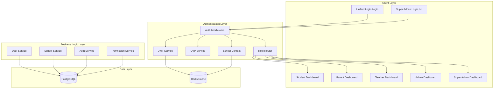
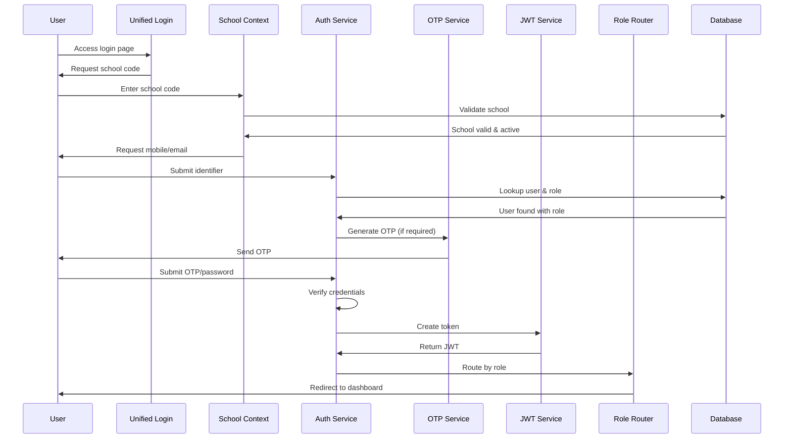

# Design Document

## Overview

This design document outlines the architecture for refactoring the School ERP SaaS into a production-grade multi-tenant system with unified authentication. The system will implement a dual-path authentication approach: a unified login for all school-based users and a separate secure route for super admins. The architecture emphasizes tenant isolation, role-based access control, and scalable session management.

## Architecture

### High-Level Architecture



### Authentication Flow Architecture



## Components and Interfaces

### Authentication Service

**Purpose**: Central authentication logic handling all user types and authentication methods.

**Key Methods**:
- `authenticateUser(identifier: string, schoolId: string, credentials: AuthCredentials): Promise<AuthResult>`
- `generateOTP(identifier: string): Promise<OTPResult>`
- `verifyOTP(identifier: string, code: string): Promise<boolean>`
- `validatePassword(userId: string, password: string): Promise<boolean>`
- `createSession(user: User, schoolId: string): Promise<SessionToken>`

**Interfaces**:
```typescript
interface AuthCredentials {
  type: 'otp' | 'password'
  value: string
}

interface AuthResult {
  success: boolean
  user?: User
  token?: string
  requiresSchoolSelection?: boolean
  availableSchools?: School[]
}

interface SessionToken {
  token: string
  expiresAt: Date
  user: User
  activeSchoolId: string
  permissions: Permission[]
}
```

### School Context Service

**Purpose**: Manages school identification, validation, and context switching.

**Key Methods**:
- `validateSchoolCode(code: string): Promise<School | null>`
- `getUserSchools(userId: string): Promise<School[]>`
- `switchSchoolContext(userId: string, schoolId: string): Promise<boolean>`
- `validateSchoolAccess(userId: string, schoolId: string): Promise<boolean>`

### OTP Service

**Purpose**: Handles OTP generation, storage, and verification with rate limiting.

**Key Methods**:
- `generateOTP(identifier: string): Promise<{ code: string, expiresAt: Date }>`
- `verifyOTP(identifier: string, code: string): Promise<boolean>`
- `isRateLimited(identifier: string): Promise<boolean>`
- `incrementAttempts(identifier: string): Promise<void>`
- `cleanupExpiredOTPs(): Promise<void>`

**Rate Limiting Rules**:
- Maximum 3 OTP requests per identifier per 5-minute window
- Maximum 3 verification attempts per OTP
- Exponential backoff for repeated failures
- Temporary blocking after abuse detection

### Role Router Service

**Purpose**: Routes authenticated users to appropriate dashboards based on role and context.

**Key Methods**:
- `getRouteForRole(role: UserRole, context: SessionContext): string`
- `validateRouteAccess(user: User, route: string): boolean`
- `getDefaultRoute(user: User): string`

**Routing Rules**:
```typescript
const ROLE_ROUTES = {
  STUDENT: '/student/dashboard',
  PARENT: '/parent/dashboard',
  TEACHER: '/teacher/dashboard',
  SCHOOL_ADMIN: '/admin/dashboard',
  SUPER_ADMIN: '/super-admin'
}
```

### JWT Service

**Purpose**: Manages JWT token creation, validation, and refresh with secure claims.

**Key Methods**:
- `createToken(payload: TokenPayload): string`
- `verifyToken(token: string): Promise<TokenPayload | null>`
- `refreshToken(token: string): Promise<string>`
- `revokeToken(token: string): Promise<void>`

**Token Structure**:
```typescript
interface TokenPayload {
  userId: string
  role: UserRole
  authorizedSchools: string[]
  activeSchoolId?: string
  permissions: string[]
  iat: number
  exp: number
}
```

### Permission Service

**Purpose**: Manages role-based permissions and access control validation.

**Key Methods**:
- `getUserPermissions(userId: string, schoolId: string): Promise<Permission[]>`
- `hasPermission(userId: string, permission: string, schoolId: string): Promise<boolean>`
- `validateRouteAccess(userId: string, route: string): Promise<boolean>`

## Data Models

### Updated Prisma Schema

```prisma
model User {
  id           String   @id @default(cuid())
  name         String
  mobile       String?  @unique
  email        String?  @unique
  passwordHash String?
  isActive     Boolean  @default(true)
  createdAt    DateTime @default(now())
  updatedAt    DateTime @updatedAt
  
  // Relationships
  userSchools  UserSchool[]
  otpCodes     OTP[]
  auditLogs    AuditLog[]
  
  @@map("users")
}

model UserSchool {
  id       String   @id @default(cuid())
  userId   String
  schoolId String
  role     UserRole
  isActive Boolean  @default(true)
  
  // Relationships
  user   User   @relation(fields: [userId], references: [id], onDelete: Cascade)
  school School @relation(fields: [schoolId], references: [id], onDelete: Cascade)
  
  @@unique([userId, schoolId])
  @@map("user_schools")
}

model School {
  id              String   @id @default(cuid())
  name            String
  schoolCode      String   @unique
  plan            String   @default("FREE")
  status          SchoolStatus @default(ACTIVE)
  isOnboarded     Boolean  @default(false)
  onboardingStep  Int      @default(0)
  createdAt       DateTime @default(now())
  updatedAt       DateTime @updatedAt
  
  // Relationships
  userSchools     UserSchool[]
  students        Student[]
  auditLogs       AuditLog[]
  
  @@map("schools")
}

model Student {
  id               String @id @default(cuid())
  schoolId         String
  admissionNumber  String
  name             String
  parentMobile     String?
  class            String?
  section          String?
  
  // Relationships
  school School @relation(fields: [schoolId], references: [id], onDelete: Cascade)
  
  @@unique([schoolId, admissionNumber])
  @@map("students")
}

model OTP {
  id         String   @id @default(cuid())
  identifier String   // mobile or email
  codeHash   String
  expiresAt  DateTime
  attempts   Int      @default(0)
  isUsed     Boolean  @default(false)
  createdAt  DateTime @default(now())
  
  // Relationships
  user User @relation(fields: [identifier], references: [mobile])
  
  @@map("otps")
}

model Session {
  id             String   @id @default(cuid())
  userId         String
  token          String   @unique
  activeSchoolId String?
  expiresAt      DateTime
  createdAt      DateTime @default(now())
  lastAccessAt   DateTime @default(now())
  
  @@map("sessions")
}

model AuditLog {
  id        String   @id @default(cuid())
  userId    String?
  schoolId  String?
  action    String
  details   Json?
  ipAddress String?
  userAgent String?
  createdAt DateTime @default(now())
  
  // Relationships
  user   User?   @relation(fields: [userId], references: [id])
  school School? @relation(fields: [schoolId], references: [id])
  
  @@map("audit_logs")
}

enum UserRole {
  STUDENT
  PARENT
  TEACHER
  SCHOOL_ADMIN
  SUPER_ADMIN
}

enum SchoolStatus {
  ACTIVE
  SUSPENDED
  INACTIVE
}
```

### Session Management

**Session Structure**:
```typescript
interface UserSession {
  userId: string
  role: UserRole
  authorizedSchools: string[]
  activeSchoolId?: string
  activeStudentId?: string // For parents
  permissions: string[]
  expiresAt: Date
}
```

**Context Switching**:
- School context stored in session
- Parent-child context for multi-child parents
- Secure context validation on every request
- Context inheritance for nested permissions

## Authentication Middleware Architecture

### Middleware Stack

```typescript
// Middleware composition
const authMiddleware = compose([
  rateLimitMiddleware,
  jwtValidationMiddleware,
  schoolContextMiddleware,
  roleValidationMiddleware,
  auditLoggingMiddleware
])
```

### Route Protection Levels

1. **Public Routes**: No authentication required
2. **Authenticated Routes**: Valid JWT required
3. **Role-Specific Routes**: Role validation required
4. **School-Scoped Routes**: School context validation required
5. **Super Admin Routes**: Enhanced security checks

### Middleware Implementation

```typescript
interface AuthMiddleware {
  validateJWT(req: Request): Promise<TokenPayload | null>
  validateSchoolAccess(userId: string, schoolId: string): Promise<boolean>
  validateRoleAccess(role: UserRole, route: string): boolean
  logAuthEvent(event: AuthEvent): Promise<void>
}
```

## Error Handling

### Authentication Error Types

```typescript
enum AuthErrorType {
  INVALID_CREDENTIALS = 'INVALID_CREDENTIALS',
  SCHOOL_NOT_FOUND = 'SCHOOL_NOT_FOUND',
  SCHOOL_INACTIVE = 'SCHOOL_INACTIVE',
  OTP_EXPIRED = 'OTP_EXPIRED',
  OTP_INVALID = 'OTP_INVALID',
  RATE_LIMITED = 'RATE_LIMITED',
  UNAUTHORIZED_SCHOOL = 'UNAUTHORIZED_SCHOOL',
  INVALID_ROLE = 'INVALID_ROLE',
  SESSION_EXPIRED = 'SESSION_EXPIRED'
}
```

### Error Response Format

```typescript
interface AuthErrorResponse {
  success: false
  error: {
    type: AuthErrorType
    message: string
    details?: any
    retryAfter?: number
  }
}
```

### Error Handling Strategy

- Graceful degradation for network issues
- Clear error messages for user guidance
- Security-conscious error disclosure
- Comprehensive error logging
- Rate limiting error responses

## Testing Strategy

### Dual Testing Approach

The testing strategy combines unit tests for specific scenarios and property-based tests for comprehensive coverage:

**Unit Tests Focus**:
- Specific authentication flows
- Error condition handling
- Edge cases (expired OTPs, invalid school codes)
- Integration between components
- Security boundary validation

**Property-Based Tests Focus**:
- Universal authentication properties
- Session management consistency
- Data isolation guarantees
- Role-based access control
- Multi-tenant security properties

**Property-Based Testing Configuration**:
- Use `fast-check` library for TypeScript/JavaScript
- Minimum 100 iterations per property test
- Each test tagged with: **Feature: unified-auth-multitenant-refactor, Property {number}: {property_text}**
- Properties validate design correctness across all possible inputs

**Test Environment Setup**:
- Isolated test database per test suite
- Mock external services (SMS, email)
- Comprehensive test data generators
- Performance benchmarking for authentication flows

## Correctness Properties

*A property is a characteristic or behavior that should hold true across all valid executions of a system—essentially, a formal statement about what the system should do. Properties serve as the bridge between human-readable specifications and machine-verifiable correctness guarantees.*

### Property 1: Unified Login Redirection
*For any* unauthenticated school user accessing a protected route, the system should redirect to the unified login page at /login
**Validates: Requirements 1.2**

### Property 2: School Code Validation
*For any* school code input, the system should validate existence and active status before allowing authentication to proceed
**Validates: Requirements 2.2, 2.3**

### Property 3: School Context Security
*For any* valid school code, the system should securely load and maintain school context throughout the authentication process
**Validates: Requirements 2.4, 2.5**

### Property 4: Role-Based Authentication Method Determination
*For any* user authentication attempt, the system should automatically determine and apply the correct authentication method (OTP for students/parents, OTP or password for teachers, password with optional OTP for school admins) based on the user's role without user selection
**Validates: Requirements 3.1, 3.2, 3.3, 3.4, 3.5**

### Property 5: OTP Security and Lifecycle Management
*For any* OTP generation and verification cycle, the system should generate secure 6-digit codes with 2-5 minute expiration, store hashed versions with attempt counters, implement rate limiting (max 3 requests per 5 minutes), and block identifiers after 3 failed attempts
**Validates: Requirements 4.1, 4.2, 4.3, 4.4, 4.5, 4.6, 4.7**

### Property 6: Multi-School User Context Management
*For any* user with access to multiple schools, the system should display school selection after authentication, store active school context in session, and allow context switching without re-authentication while validating access permissions
**Validates: Requirements 5.1, 5.2, 5.3, 5.4, 5.5**

### Property 7: Parent Multi-Child Context Management
*For any* parent linked to multiple students, the system should display child selection after login, store active student context in session, allow child switching without re-authentication, and display child information including name and class
**Validates: Requirements 6.1, 6.2, 6.3, 6.4, 6.5**

### Property 8: Role-Based Dashboard Routing
*For any* authenticated user, the system should redirect to the appropriate dashboard based on role (student→/student/dashboard, parent→/parent/dashboard, teacher→/teacher/dashboard, school_admin→/admin/dashboard) and prevent access to dashboards not matching their role
**Validates: Requirements 7.1, 7.2, 7.3, 7.4, 7.6**

### Property 9: Tenant Data Isolation
*For any* database query or API request, the system should filter results by active school context, validate school permissions, reject unauthorized school access attempts, and validate URL parameters against authorized schools
**Validates: Requirements 8.1, 8.2, 8.3, 8.4**

### Property 10: School Onboarding State Management
*For any* school, the system should set isOnboarded to false on creation, redirect non-onboarded school admins to setup wizard, update isOnboarded to true on completion, and allow super admin to reset onboarding state while tracking progress independently per school
**Validates: Requirements 9.1, 9.2, 9.3, 9.4, 9.5**

### Property 11: Super Admin Universal Access
*For any* school or user account, super admin should be able to create schools with unique codes, change school status, assign plans and limits, control setup wizards, manage user accounts, view analytics and payment status, and perform emergency disabling
**Validates: Requirements 10.1, 10.2, 10.3, 10.4, 10.5, 10.6, 10.7**

### Property 12: JWT Session Management
*For any* user authentication, the system should create JWT tokens with user ID, role, and authorized school IDs, update sessions with active school context, validate tokens on API requests, handle session expiration with redirect and cleanup, and implement secure token refresh
**Validates: Requirements 11.1, 11.2, 11.3, 11.4, 11.5**

### Property 13: Route Protection and Access Control
*For any* route access attempt, the system should verify authentication tokens for protected routes, validate roles for role-specific routes, validate school access for school-specific routes, and enforce additional security for super admin routes
**Validates: Requirements 12.1, 12.2, 12.3, 12.4**

### Property 14: Database Integrity and Constraints
*For any* database operation, the system should enforce foreign key constraints, maintain data integrity, and ensure proper model relationships between users, schools, students, and OTPs
**Validates: Requirements 13.6**

### Property 15: Rate Limiting and Abuse Prevention
*For any* authentication attempt, the system should enforce OTP rate limits (3 per mobile per 5 minutes), implement exponential backoff for repeated failures, and temporarily block sources showing suspicious activity
**Validates: Requirements 14.1, 14.2, 14.3**

### Property 16: Comprehensive Audit Logging
*For any* authentication event (successful login, failure, context switch, admin action), the system should log the event with timestamp, context, failure reasons, source information, and administrator details as appropriate
**Validates: Requirements 8.5, 12.5, 14.4, 15.1, 15.2, 15.3, 15.4**