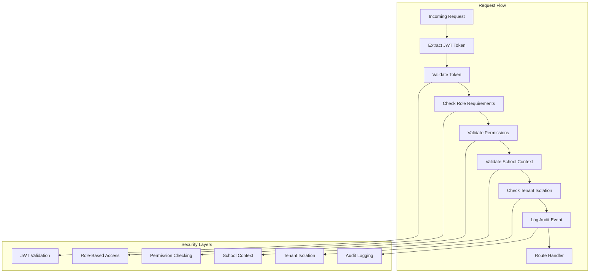

# Enhanced Authentication Middleware

## Overview

The Enhanced Authentication Middleware provides comprehensive security for the School ERP SaaS application with JWT validation, school context validation, role-based route protection, tenant data isolation, and comprehensive audit logging.

## Features

### 🔐 JWT Token Validation
- Secure JWT token verification with expiration checking
- Token refresh mechanism for long-lived sessions
- Automatic token revocation and blacklisting
- Support for both header and cookie-based tokens

### 🏫 School Context Validation
- Automatic school context resolution from JWT tokens
- Validation of school status (active/inactive)
- User-school relationship verification
- Cross-school access prevention

### 👥 Role-Based Access Control
- Fine-grained role-based permissions
- Support for multiple roles per route
- Dynamic permission checking
- Role hierarchy enforcement

### 🏢 Tenant Data Isolation
- Strict tenant isolation between schools
- Cross-tenant access prevention
- School-specific data filtering
- Audit logging for isolation violations

### 📊 Comprehensive Audit Logging
- Detailed authentication event logging
- Security incident tracking
- Performance monitoring
- Compliance reporting

## Architecture



## Usage Examples

### Basic Authentication

```typescript
import { createEnhancedAuthMiddleware } from '@/lib/middleware/enhanced-auth';

// Simple authenticated route
export const GET = createEnhancedAuthMiddleware({
  auditAction: 'API_ACCESS'
})(async (request) => {
  return NextResponse.json({ message: 'Authenticated access' });
});
```

### Role-Based Protection

```typescript
import { createSchoolAdminRoute } from '@/lib/middleware/enhanced-compose';

// School admin only route
export const POST = createSchoolAdminRoute(
  async (context) => {
    const { user, schoolContext } = context;
    
    return NextResponse.json({
      message: 'Admin access granted',
      school: schoolContext?.schoolCode
    });
  },
  {
    additionalPermissions: ['user:write'],
    rateLimit: { windowMs: 15 * 60 * 1000, max: 100 }
  }
);
```

### Multi-Role Access

```typescript
import { createMultiRoleRoute } from '@/lib/middleware/enhanced-compose';

// Teacher or Admin access
export const PUT = createMultiRoleRoute(
  [UserRole.TEACHER, UserRole.SCHOOL_ADMIN],
  async (context) => {
    const { user } = context;
    
    if (user!.role === UserRole.SCHOOL_ADMIN) {
      // Admin logic
    } else {
      // Teacher logic
    }
    
    return NextResponse.json({ success: true });
  }
);
```

### Tenant Isolation

```typescript
import { createTenantIsolatedRoute } from '@/lib/middleware/enhanced-compose';

// Only specific schools can access
export const GET = createTenantIsolatedRoute(
  ['school-123', 'school-456'],
  async (context) => {
    return NextResponse.json({
      message: 'Tenant-isolated access',
      school: context.schoolContext?.schoolCode
    });
  }
);
```

### Custom Validation

```typescript
import { createContextAwareAuth } from '@/lib/middleware/auth';

export const DELETE = createContextAwareAuth({
  requiredRole: UserRole.SCHOOL_ADMIN,
  contextValidator: async (user, request) => {
    // Custom business logic validation
    const resourceId = new URL(request.url).searchParams.get('id');
    return await validateResourceAccess(user.id, resourceId);
  },
  onAccessDenied: async (user, request) => {
    // Custom access denied handling
    await logSecurityIncident(user, request);
  }
})(async (request) => {
  // Route handler
  return NextResponse.json({ deleted: true });
});
```

## Configuration Options

### EnhancedAuthConfig

```typescript
interface EnhancedAuthConfig {
  // Role requirements
  requiredRole?: UserRole | UserRole[];
  
  // Permission requirements
  requiredPermissions?: string[];
  
  // School context validation
  requireSchoolContext?: boolean;
  
  // Tenant isolation
  allowedSchools?: string[];
  
  // Anonymous access
  allowAnonymous?: boolean;
  
  // Skip JWT validation (for public routes)
  skipJWTValidation?: boolean;
  
  // Custom audit action name
  auditAction?: string;
}
```

### Middleware Composition

```typescript
interface EnhancedMiddlewareConfig {
  // Authentication configuration
  auth?: EnhancedAuthConfig;
  
  // Rate limiting
  rateLimit?: {
    windowMs: number;
    max: number;
    keyGenerator?: (request: NextRequest) => string;
  };
  
  // CORS configuration
  cors?: {
    origin?: string | string[];
    methods?: string[];
    allowedHeaders?: string[];
  };
  
  // Request validation
  validation?: {
    body?: any; // JSON schema
    query?: any; // JSON schema
    params?: any; // JSON schema
  };
}
```

## Security Features

### JWT Token Security

- **Secure Token Storage**: Tokens are validated and never stored in logs
- **Expiration Handling**: Automatic token expiration checking
- **Revocation Support**: Blacklisted tokens are rejected
- **Refresh Mechanism**: Secure token refresh for long sessions

### School Context Security

- **Context Validation**: Active school status verification
- **Access Control**: User-school relationship validation
- **Cross-School Prevention**: Automatic cross-school access blocking
- **Context Switching**: Secure school context switching

### Tenant Isolation

- **Data Isolation**: Strict separation between school data
- **Access Validation**: Multi-layer access validation
- **Violation Detection**: Automatic isolation violation detection
- **Audit Logging**: Comprehensive isolation event logging

### Audit Logging

- **Event Tracking**: All authentication events logged
- **Security Monitoring**: Suspicious activity detection
- **Compliance**: Detailed audit trails for compliance
- **Performance**: Authentication performance monitoring

## Error Handling

### Authentication Errors

```typescript
// JWT validation errors
{
  success: false,
  error: "Token validation failed: TOKEN_EXPIRED",
  statusCode: 401
}

// Role permission errors
{
  success: false,
  error: "Required role: TEACHER, got: STUDENT",
  statusCode: 403
}

// School context errors
{
  success: false,
  error: "Invalid or inactive school context",
  statusCode: 403
}

// Tenant isolation errors
{
  success: false,
  error: "User not authorized for requested school",
  statusCode: 403
}
```

### Error Response Format

```typescript
interface ErrorResponse {
  error: string;
  code: 'UNAUTHORIZED' | 'FORBIDDEN' | 'INTERNAL_ERROR';
  details?: {
    reason: string;
    timestamp: string;
    requestId: string;
  };
}
```

## Performance Considerations

### Caching

- **JWT Validation**: Token validation results cached
- **School Context**: School data cached for performance
- **Permissions**: User permissions cached per session
- **Audit Events**: Batched audit logging for performance

### Optimization

- **Lazy Loading**: School context loaded only when needed
- **Batch Operations**: Multiple validations batched together
- **Connection Pooling**: Database connections pooled
- **Memory Management**: Efficient memory usage patterns

## Monitoring and Alerting

### Security Metrics

- Authentication success/failure rates
- Token validation performance
- School context validation times
- Tenant isolation violations
- Suspicious activity patterns

### Alerts

- **Critical**: Multiple failed authentication attempts
- **High**: Tenant isolation violations
- **Medium**: Unusual access patterns
- **Low**: Performance degradation

### Dashboards

- Real-time authentication metrics
- Security incident tracking
- Performance monitoring
- Compliance reporting

## Migration Guide

### From Legacy Middleware

1. **Update Imports**:
   ```typescript
   // Old
   import { authenticate } from '@/lib/middleware/auth';
   
   // New
   import { enhancedAuthenticate } from '@/lib/middleware/enhanced-auth';
   ```

2. **Update Configuration**:
   ```typescript
   // Old
   const config = {
     requiredRole: 'ADMIN',
     requiredPermissions: ['user:read']
   };
   
   // New
   const config = {
     requiredRole: UserRole.SCHOOL_ADMIN,
     requiredPermissions: ['user:read'],
     requireSchoolContext: true
   };
   ```

3. **Update Route Handlers**:
   ```typescript
   // Old
   export async function GET(request: NextRequest) {
     const authResult = await authenticate(request, config);
     // Handle result
   }
   
   // New
   export const GET = createSchoolAdminRoute(
     async (context) => {
       const { user, schoolContext } = context;
       // Use context
     }
   );
   ```

## Testing

### Unit Tests

```typescript
import { enhancedAuthenticate } from '@/lib/middleware/enhanced-auth';

describe('Enhanced Authentication', () => {
  it('should validate JWT tokens', async () => {
    const result = await enhancedAuthenticate(mockRequest, {});
    expect(result.success).toBe(true);
  });
  
  it('should enforce role-based access', async () => {
    const result = await enhancedAuthenticate(mockRequest, {
      requiredRole: UserRole.TEACHER
    });
    expect(result.success).toBe(true);
  });
});
```

### Integration Tests

```typescript
describe('Authentication Integration', () => {
  it('should handle complete authentication flow', async () => {
    // Test complete flow from token to route handler
  });
  
  it('should enforce tenant isolation', async () => {
    // Test cross-school access prevention
  });
});
```

### Property-Based Tests

```typescript
import fc from 'fast-check';

describe('Authentication Properties', () => {
  it('should consistently validate tokens', () => {
    fc.assert(fc.property(
      fc.string(),
      async (token) => {
        // Property: Valid tokens always succeed
        // Invalid tokens always fail
      }
    ));
  });
});
```

## Best Practices

### Security

1. **Always Use HTTPS**: Never transmit tokens over HTTP
2. **Token Rotation**: Implement regular token rotation
3. **Audit Everything**: Log all authentication events
4. **Principle of Least Privilege**: Grant minimum required permissions
5. **Context Validation**: Always validate school context

### Performance

1. **Cache Wisely**: Cache validation results appropriately
2. **Batch Operations**: Batch multiple validations
3. **Lazy Loading**: Load context only when needed
4. **Monitor Performance**: Track authentication performance

### Maintenance

1. **Regular Updates**: Keep dependencies updated
2. **Security Reviews**: Regular security audits
3. **Performance Monitoring**: Monitor authentication metrics
4. **Documentation**: Keep documentation current

## Troubleshooting

### Common Issues

1. **Token Expired**: Implement token refresh
2. **School Context Missing**: Ensure school context in JWT
3. **Permission Denied**: Check role and permission configuration
4. **Tenant Isolation**: Verify school access permissions

### Debug Mode

```typescript
// Enable debug logging
process.env.AUTH_DEBUG = 'true';

// Check authentication result
const result = await enhancedAuthenticate(request, config);
console.log('Auth Result:', result);
```

### Logging

```typescript
// Authentication events are automatically logged
// Check audit logs for detailed information
await authAuditLogger.logAuthEvent({
  action: 'DEBUG_AUTH',
  details: 'Debug authentication flow',
  // ... other details
});
```

## Support

For issues or questions about the Enhanced Authentication Middleware:

1. Check the troubleshooting section
2. Review audit logs for detailed error information
3. Enable debug mode for additional logging
4. Contact the development team with specific error details

## Changelog

### v2.0.0 (Current)
- Enhanced JWT validation with comprehensive error handling
- School context validation with tenant isolation
- Role-based access control with fine-grained permissions
- Comprehensive audit logging with security monitoring
- Performance optimizations and caching

### v1.0.0 (Legacy)
- Basic authentication with session management
- Simple role checking
- Limited audit logging