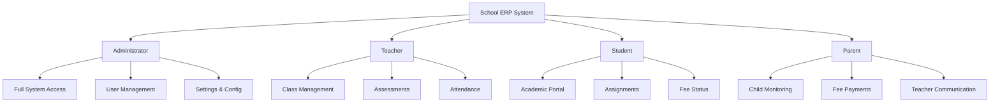
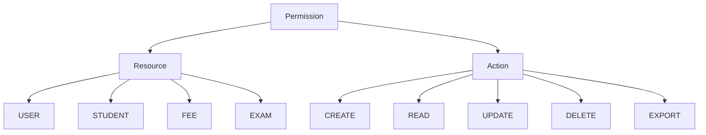

# 🏫 School ERP System - Complete Documentation & User Manual

---

## 📑 Table of Contents

1. [System Overview](#system-overview)
2. [Technology Stack](#technology-stack)
3. [User Roles & Access](#user-roles--access)
4. [Module Reference](#module-reference)
5. [User Manual - Administrator](#user-manual---administrator)
6. [User Manual - Teacher](#user-manual---teacher)
7. [User Manual - Student](#user-manual---student)
8. [User Manual - Parent](#user-manual---parent)
9. [Dashboard Features](#dashboard-features)
10. [Reports & Analytics](#reports--analytics)
11. [System Configuration](#system-configuration)
12. [Security Features](#security-features)
13. [Indian Education System Support](#indian-education-system-support)
14. [Troubleshooting Guide](#troubleshooting-guide)

---

## System Overview

The School ERP (Enterprise Resource Planning) system is a comprehensive, enterprise-grade web platform designed to manage all aspects of school operations. Built with modern technologies, it provides role-based dashboards and features for administrators, teachers, students, and parents.

### Key Highlights

| Feature | Description |
|---------|-------------|
| 🎓 **Academic Management** | Classes, subjects, exams, report cards |
| 💰 **Finance & Fees** | Fee collection, scholarships, payroll, budgets |
| 📚 **Digital Library** | Book catalog, issue/return, reservations |
| 🚌 **Transport System** | Routes, vehicles, tracking, attendance |
| 🏢 **Hostel Management** | Rooms, allocations, complaints, visitors |
| 📱 **Multi-Channel Communication** | SMS, Email, WhatsApp, In-app notifications |
| 📊 **Advanced Reporting** | Scheduled reports, analytics, exports |
| 🔐 **Security** | 2FA, RBAC, permissions, audit logs |
| 🎯 **LMS Platform** | Courses, modules, quizzes, progress tracking |
| 📝 **Online Examinations** | Question banks, timed exams, auto-grading |
| 🎫 **Digital Certificates** | Templates, generation, QR verification |
| 📋 **Admission Portal** | Applications, documents, merit lists |

---

## Technology Stack

### Frontend
- **Framework**: Next.js 15 (React 18)
- **Styling**: Tailwind CSS
- **UI Components**: Radix UI, shadcn/ui
- **State Management**: React Hook Form, TanStack Query
- **Data Tables**: TanStack Table
- **Animations**: Framer Motion

### Backend
- **Runtime**: Node.js
- **Database**: PostgreSQL
- **ORM**: Prisma
- **Authentication**: NextAuth v5 (Auth.js)
- **File Storage**: Cloudinary

### Integrations
| Service | Purpose |
|---------|---------|
| Resend | Email delivery |
| Twilio | SMS notifications |
| MSG91 | SMS (India) |
| WhatsApp Business API | WhatsApp messaging |
| Razorpay | Payment gateway |
| Upstash Redis | Rate limiting & caching |
| Svix | Webhooks |

### Security & Utilities
- **2FA**: OTPAuth (TOTP + Backup Codes)
- **PDF Generation**: jsPDF, jsPDF-AutoTable
- **QR/Barcode**: qrcode, jsbarcode
- **Excel/CSV**: xlsx, PapaParse
- **Testing**: Vitest, Testing Library

---

## User Roles & Access

The system supports four primary user roles:



### Role Capabilities Matrix

| Capability | Admin | Teacher | Student | Parent |
|------------|:-----:|:-------:|:-------:|:------:|
| Manage Users | ✅ | ❌ | ❌ | ❌ |
| Create Exams | ✅ | ✅ | ❌ | ❌ |
| View Grades | ✅ | ✅ | ✅ | ✅ |
| Mark Attendance | ✅ | ✅ | ❌ | ❌ |
| Submit Assignments | ❌ | ❌ | ✅ | ❌ |
| Pay Fees | ❌ | ❌ | ❌ | ✅ |
| Access Reports | ✅ | ✅ | Limited | Limited |
| System Settings | ✅ | ❌ | ❌ | ❌ |
| Send Announcements | ✅ | Limited | ❌ | ❌ |

---

## Module Reference

### 1. User Management 👥


**Locations**: `/admin/users`, `/admin/users/students`, `/admin/users/teachers`, `/admin/users/parents`

**Features**:
- Multi-role user creation (Admin, Teacher, Student, Parent)
- Profile management with avatars
- Two-factor authentication support
- Parent-student relationship linking
- Bulk import via CSV/Excel
- User activity tracking

**Indian-Specific Fields**:
- Aadhaar Number (12-digit)
- ABC ID (Academic Bank of Credits)
- Caste & Category (General, OBC, SC, ST, EWS)
- Transfer Certificate Number
- Religion, Mother Tongue, Birth Place

---

### 2. Academic Management 🎓

**Locations**: `/admin/academic`, `/admin/classes`, `/admin/teaching`

**Components**:

#### Academic Years & Terms
- Create academic years with start/end dates
- Define terms/semesters within each year
- Set current active year and term

#### Classes & Sections
- Multi-level class structure (e.g., "Grade 10 - Section A")
- Section capacity management
- Class teacher assignments
- Student enrollment tracking

#### Subjects & Departments
- Subject creation with unique codes
- Department-wise organization
- Subject-teacher-class mapping
- Curriculum and syllabus management

#### Lessons & Syllabus
- Chapter/module organization
- Lesson planning with resources
- Progress tracking for teachers
- Document attachments

---

### 3. Timetable Management 📅

**Location**: `/admin/teaching/timetable`

**Features**:
- Flexible timetable creation
- Day-wise schedule configuration
- Period-based time slots
- Subject-teacher-room assignments
- Conflict detection
- Multiple timetables for different terms

---

### 4. Assessment & Examination 📝

**Locations**: `/admin/assessment`, `/admin/assessment/exams`, `/admin/assessment/marks-entry`

#### Traditional Exams
- Exam types: Mid-term, Final, Unit Test (with weights)
- Scheduling with date, time, total marks
- Mark entry with components (theory, practical, internal)
- Grade calculation and scaling
- Absence tracking

#### Online Examinations
**Location**: `/admin/assessment/exams/online`

- Question bank with MCQ, True/False, Essay types
- Difficulty levels and topic tagging
- Timed exams with auto-submission
- Question randomization
- IP and browser tracking for security
- Auto-grading for objective questions

#### Assignments
**Location**: `/admin/assessment/assignments`

- Assignment creation with deadlines
- File attachments and instructions
- Student submissions tracking
- Grading with feedback
- Late submission handling

#### Report Cards
**Location**: `/admin/assessment/report-cards`

- Term-wise report card generation
- Customizable templates (CBSE, State Board, Custom)
- Co-scholastic grade integration
- PDF generation with school branding
- Batch generation support

---

### 5. Attendance Management 📊

**Location**: `/admin/attendance`

#### Student Attendance
- Daily attendance marking by section
- Status options: Present, Absent, Late, Half-day, Leave
- Attendance reports and analytics
- Minimum threshold monitoring
- Parent notifications for absences

#### Teacher Attendance
- Daily teacher attendance
- Leave tracking
- Reports generation

#### Leave Applications
- Leave request submission
- Multi-level approval workflow
- Document attachments
- Status tracking

---

### 6. Finance & Fee Management 💰

**Location**: `/admin/finance`

#### Fee Structure
- Fee types: Tuition, Library, Sports, Lab, etc.
- Frequency: One-time, Monthly, Quarterly, Annual
- Class-specific variations
- Academic year-based structures

#### Fee Collection
**Location**: `/admin/finance/fees`

- Multiple payment methods (Cash, Card, Online, Bank Transfer)
- Partial payments and balance tracking
- Receipt generation
- Online payment via Razorpay
- Receipt upload and verification

#### Scholarships
**Location**: `/admin/finance/scholarships`

- Scholarship program creation
- Criteria and amount definition
- Student assignment
- Duration tracking

#### Expenses & Budget
**Locations**: `/admin/finance/expenses`, `/admin/finance/budget`

- Expense recording with categories
- Budget allocation by category
- Utilization tracking
- Receipt attachments

#### Payroll
**Location**: `/admin/finance/payroll`

- Teacher salary management
- Allowances and deductions
- Monthly processing
- Payment tracking

---

### 7. Communication System 📢

**Location**: `/admin/communication`

#### Messaging
- Internal messaging system
- Direct user-to-user messages
- File attachments
- Read receipts

#### Announcements
**Location**: `/admin/communication/announcements`

- School-wide announcements
- Role-based targeting
- Date-based activation/expiration
- File attachments

#### Bulk Messaging
**Location**: `/admin/communication/bulk-messaging`

- SMS, Email, WhatsApp campaigns
- Message templates with variables
- Recipient filtering
- Delivery tracking and cost reporting

#### Parent-Teacher Meetings
**Location**: `/admin/communication/parent-meetings`

- Meeting scheduling
- Request and approval workflow
- Status tracking
- Location and notes

---

### 8. Library Management 📚

**Location**: `/admin/library`

**Features**:
- Book catalog with ISBN, author, publisher
- Quantity and availability tracking
- Book issue and return management
- Fine calculation for overdue books
- Book reservations
- Usage reports

---

### 9. Transport Management 🚌

**Location**: `/admin/transport`

**Features**:
- Vehicle registration and management
- Driver profiles with license tracking
- Route creation with stops
- Student route assignment
- Transport attendance (boarding/alighting)
- Fee integration

---

### 10. Hostel Management 🏢

**Location**: `/admin/hostel`

**Features**:
- Multiple hostels support (Boys, Girls, Mixed)
- Room management (capacity, amenities, fees)
- Room allocation with bed tracking
- Visitor check-in/check-out
- Fee management (room + mess)
- Complaint management with priorities

---

### 11. Learning Management System (LMS) 🎯

**Location**: `/teacher/courses` (Teacher), `/student/courses` (Student)

**Features**:
- Course creation with modules and lessons
- Multiple content types (Text, Video, Audio, PDF)
- Progress tracking per student
- Quizzes with pass/fail criteria
- Discussion forums
- Certificate issuance on completion

---

### 12. Admission Portal 🎓

**Location**: `/admin/admissions`, `/admission` (Public)

**Features**:
- Online application form
- Document upload (Birth certificate, Report cards, Photos)
- Application review workflow
- Merit list generation with configurable criteria
- Application to student conversion
- Status tracking (Submitted, Under Review, Accepted, Rejected, Waitlisted)

---

### 13. Certificate System 🏆

**Location**: `/admin/certificates`

**Features**:
- Certificate templates (Achievement, Completion, Merit)
- Visual template designer
- Merge fields for personalization
- QR code/barcode for verification
- PDF generation
- Public verification page at `/verify-certificate`

---

### 14. ID Card Generation 🆔

**Location**: `/admin/id-cards`

**Features**:
- Student and teacher ID cards
- QR code integration
- Barcode support
- Photo integration
- Batch printing

---

### 15. Calendar & Events 📆

**Location**: `/admin/calendar`, `/admin/events`

**Features**:
- Academic calendar with categories
- Event creation with RSVP
- Role-based visibility
- Recurring events support
- Integration with exams and assignments
- Reminders and notifications

---

### 16. Reports & Analytics 📈

**Location**: `/admin/reports`

**Report Types**:
- Academic reports
- Attendance summaries
- Financial reports
- Comparative analysis
- Performance analytics

**Features**:
- Scheduled report generation
- Multiple export formats (PDF, Excel, CSV)
- Email delivery
- Custom report builder

---

### 17. Settings & Configuration ⚙️

**Location**: `/admin/settings`

**Sections**:
- School Information (name, address, logo)
- Academic Settings (grading scale, attendance threshold)
- Notification Settings (email, SMS, push)
- Security Settings (session timeout, password policy, 2FA)
- Branding (themes, colors, email templates)
- Payment Configuration
- Backup Management

---

## User Manual - Administrator

### Getting Started

1. **Login**: Access the admin portal at `/admin` with your credentials
2. **Dashboard**: View key metrics - student count, fee collection, attendance overview
3. **Navigation**: Use the sidebar to access different modules

### Common Tasks

#### Adding a New Student
1. Navigate to **Users → Students**
2. Click **Add Student** button
3. Fill in personal details (name, DOB, gender, contact)
4. Add Indian-specific information (Aadhaar, category)
5. Enter parent/guardian details
6. Select class and section
7. Click **Save**

#### Creating a Fee Structure
1. Go to **Finance → Fee Structure**
2. Click **Create New**
3. Select academic year and classes
4. Add fee types and amounts
5. Set validity dates
6. Activate the structure

#### Setting Up Exams
1. Navigate to **Assessment → Exams**
2. Click **Create Exam**
3. Select exam type, subject, class
4. Set date, time, and marks
5. Configure mark components (theory, practical, internal)
6. Add instructions
7. Publish the exam

#### Generating Report Cards
1. Go to **Assessment → Report Cards**
2. Select class, section, and term
3. Choose template
4. Click **Generate**
5. Review and publish
6. Download PDFs or send to parents

#### Sending Bulk Messages
1. Navigate to **Communication → Bulk Messaging**
2. Select recipients (by class, role, or custom)
3. Choose template or compose message
4. Select channels (SMS, Email, WhatsApp)
5. Preview and send
6. Track delivery status

### Advanced Operations

#### Permission Management
**Location**: `/admin/settings/permissions`

1. View all permissions by category
2. Assign permissions to roles
3. Grant individual user permissions
4. Set temporary permissions with expiry

#### Backup & Restore
**Location**: `/admin/settings/backups`

1. Create manual backups
2. Configure scheduled backups
3. Download backup files
4. Restore from backup

#### Audit Logs
**Location**: `/admin/audit-logs`

1. View all system activities
2. Filter by user, action, date
3. Track permission checks
4. Export for compliance

---

## User Manual - Teacher

### Dashboard Overview

The teacher dashboard displays:
- Today's schedule
- Pending assignments to grade
- Recent attendance stats
- Upcoming exams
- Messages and notifications

### Daily Tasks

#### Marking Attendance
1. Click **Attendance** in sidebar
2. Select class and section
3. Use checkboxes to mark status
4. Add reasons for absences
5. Click **Submit**

#### Creating Assignments
1. Go to **Assessments → Assignments**
2. Click **New Assignment**
3. Enter title and description
4. Select subject and classes
5. Set due date
6. Attach files if needed
7. Publish

#### Grading Submissions
1. Navigate to **Assessments → Assignments**
2. Click on an assignment
3. View submissions list
4. Open each submission
5. Enter marks and feedback
6. Submit grades

#### Entering Exam Marks
1. Go to **Assessments → Marks Entry**
2. Select exam, class, subject
3. Enter marks for each student
4. Add remarks if needed
5. Save and submit

### Online Exam Management

#### Creating Question Bank
1. Navigate to **Assessments → Question Bank**
2. Click **Add Question**
3. Select question type (MCQ, True/False, Essay)
4. Enter question and options
5. Mark correct answer
6. Set difficulty and topic
7. Save

#### Creating Online Exam
1. Go to **Assessments → Online Exams**
2. Click **Create Exam**
3. Select subject and class
4. Set duration and time window
5. Add questions from bank
6. Configure options (randomize, allow review)
7. Publish

### LMS Course Creation

1. Navigate to **Courses**
2. Click **Create Course**
3. Add course details and thumbnail
4. Create modules
5. Add lessons with content
6. Create quizzes
7. Publish course

---

## User Manual - Student

### Dashboard Features

Your dashboard shows:
- Today's timetable
- Upcoming assignments and deadlines
- Recent exam results
- Attendance summary
- Fee status
- Course progress

### Accessing Academics

#### Viewing Timetable
1. Click **Academics** in sidebar
2. Select **Timetable** tab
3. View day-wise or week-wise schedule

#### Checking Grades
1. Go to **Performance → Grades**
2. Select term
3. View subject-wise marks
4. Download report card

#### Viewing Attendance
1. Navigate to **Attendance**
2. View monthly calendar
3. Check attendance percentage
4. Apply for leave if absent

### Assignments

#### Viewing Assignments
1. Go to **Assessments → Assignments**
2. See list of pending and completed assignments
3. Filter by subject or status

#### Submitting Assignments
1. Click on assignment
2. Read instructions
3. Enter response or upload files
4. Click **Submit**
5. View submission status

### Taking Online Exams

1. Go to **Assessments → Online Exams**
2. Click on available exam
3. Read instructions
4. Click **Start Exam**
5. Answer questions
6. Use **Save & Next** to progress
7. Review answers (if allowed)
8. Click **Submit**

### Courses & LMS

1. Navigate to **Courses**
2. View enrolled courses
3. Click to enter course
4. Complete lessons in order
5. Take lesson quizzes
6. Track progress percentage

### Fee Management

1. Go to **Fees**
2. View pending payments
3. See payment history
4. Upload payment receipts (if allowed)
5. Download receipts

---

## User Manual - Parent

### Dashboard Overview

The parent dashboard shows:
- Children's overview
- Attendance summary
- Upcoming events
- Fee status
- Recent communications

### Monitoring Children

#### Switching Between Children
If you have multiple children enrolled:
1. Click on child selector dropdown
2. Select the child to view
3. Dashboard updates automatically

#### Viewing Academic Progress
1. Go to **Academics**
2. View current subjects
3. Check grades and percentages
4. Download report cards

#### Checking Attendance
1. Navigate to **Attendance**
2. View monthly calendar
3. See attendance percentage
4. View leave applications

### Communication

#### Messaging Teachers
1. Go to **Communication → Messages**
2. Click **Compose**
3. Select teacher
4. Write message
5. Send

#### Scheduling Meetings
1. Navigate to **Meetings**
2. Click **Request Meeting**
3. Select teacher and preferred date
4. Add agenda
5. Submit request
6. Wait for confirmation

#### Viewing Announcements
1. Check **Announcements** section
2. View school-wide announcements
3. Read important updates

### Fee Payments

#### Viewing Fee Details
1. Go to **Fees**
2. See pending amount
3. View fee breakdown
4. Check due dates

#### Making Payments
1. Click **Pay Now** on pending fee
2. Select payment method
3. Complete payment via Razorpay
4. Download receipt

#### Uploading Payment Receipt
If paying offline:
1. Go to **Fees → Upload Receipt**
2. Enter payment details
3. Upload receipt image
4. Submit for verification
5. Track verification status

### Events & Calendar

1. Navigate to **Calendar**
2. View upcoming events
3. RSVP to events
4. Set reminders
5. Sync with personal calendar

---

## Dashboard Features

### Admin Dashboard

```
┌────────────────────────────────────────────────────────────┐
│                      ADMIN DASHBOARD                        │
├────────────────────────────────────────────────────────────┤
│  ┌──────────┐ ┌──────────┐ ┌──────────┐ ┌──────────┐       │
│  │ Students │ │ Teachers │ │ Parents  │ │ Classes  │       │
│  │   1,245  │ │    87    │ │   985    │ │    42    │       │
│  └──────────┘ └──────────┘ └──────────┘ └──────────┘       │
├────────────────────────────────────────────────────────────┤
│  ┌─────────────────────┐ ┌─────────────────────────────┐   │
│  │   Fee Collection    │ │      Attendance Overview    │   │
│  │  ₹45,00,000 / month │ │         94.5% avg          │   │
│  │  [======    ] 75%   │ │    [================   ]   │   │
│  └─────────────────────┘ └─────────────────────────────┘   │
├────────────────────────────────────────────────────────────┤
│  Recent Activities          │  Upcoming Events            │
│  • New admission - John     │  • Annual Day - 15 Jan      │
│  • Fee paid - Sarah         │  • PTM - 20 Jan             │
│  • Leave approved - Mike    │  • Exams - 25 Jan           │
└────────────────────────────────────────────────────────────┘
```

**Widgets**:
- Student/Teacher/Parent counts
- Fee collection summary with graphs
- Attendance overview
- Recent activities feed
- Upcoming events
- Quick action buttons

### Teacher Dashboard

**Sections**:
- Today's schedule with class details
- Pending assignments to grade (count + list)
- Attendance marking quick access
- Upcoming exams
- Recent messages
- Student performance overview

### Student Dashboard

**Sections**:
- Today's timetable
- Assignments due this week
- Upcoming exams
- Recent grades
- Attendance percentage
- Course progress
- Announcements

### Parent Dashboard

**Sections**:
- Child selector (for multiple children)
- Academic performance summary
- Attendance overview
- Fee payment status
- Upcoming parent-teacher meetings
- Recent communications
- School announcements

---

## Reports & Analytics

### Available Reports

| Report Type | Description | Formats |
|-------------|-------------|---------|
| Student Reports | Academic performance, attendance | PDF, Excel |
| Class Performance | Subject-wise analysis | PDF, Excel |
| Attendance Summary | Daily/Monthly attendance | PDF, CSV |
| Fee Collection | Payment status, defaulters | PDF, Excel |
| Exam Analysis | Score distribution, comparisons | PDF, Excel |
| Library Reports | Issue/Return statistics | PDF |
| Transport Reports | Route-wise attendance | PDF |

### Scheduled Reports

1. Navigate to **Reports → Scheduled**
2. Click **Create Schedule**
3. Select report type and data source
4. Configure filters
5. Set frequency (Daily, Weekly, Monthly)
6. Add email recipients
7. Choose export format
8. Activate schedule

### Custom Report Builder

**Location**: `/admin/reports/builder`

1. Select data source (Students, Teachers, Fees, etc.)
2. Choose fields to include
3. Add filters and conditions
4. Configure sorting
5. Preview report
6. Export or schedule

---

## System Configuration

### School Settings

| Setting | Description |
|---------|-------------|
| School Name | Display name across all pages |
| Logo | Primary school logo |
| Address | Full postal address |
| Contact | Phone, Email, Website |
| Timezone | For date/time calculations |
| Tagline | School motto/tagline |

### Academic Settings

| Setting | Default | Description |
|---------|---------|-------------|
| Grading Scale | Percentage | PERCENTAGE, GPA, LETTER |
| Attendance Threshold | 75% | Minimum required attendance |
| Late Arrival Minutes | 15 | Minutes after which marked late |
| Passing Grade | 50% | Minimum passing percentage |

### Notification Settings

| Channel | Purpose |
|---------|---------|
| Email | Announcements, Reports, Alerts |
| SMS | Urgent notifications, OTPs |
| WhatsApp | Rich notifications, Updates |
| Push | In-app real-time alerts |

**Notification Triggers**:
- Student enrollment
- Fee payment/reminders
- Attendance alerts
- Exam results
- Leave applications
- Meeting schedules

### Security Settings

| Setting | Default | Recommendation |
|---------|---------|----------------|
| Session Timeout | 30 min | 15-60 min |
| Password Min Length | 8 chars | 8+ chars |
| Special Character Required | Yes | Keep enabled |
| 2FA | Optional | Recommend for admins |
| Password Expiry | 90 days | 60-90 days |
| Auto Backup | Daily | Keep enabled |

---

## Security Features

### Authentication

- **Credentials Login**: Email/password with bcrypt hashing
- **OAuth Support**: Google, GitHub providers
- **Two-Factor Authentication**: 
  - TOTP (Time-based One-Time Password)
  - Backup codes for recovery
- **Session Management**: Database sessions with configurable expiry

### Permission System



**Permission Types**:
- Role-based (default for each role)
- User-specific (custom permissions)
- Temporary (with expiration date)

### Audit Logging

**Logged Actions**:
- CREATE, READ, UPDATE, DELETE
- LOGIN, LOGOUT
- EXPORT, IMPORT
- APPROVE, REJECT
- PERMISSION_CHECK, PERMISSION_DENIED

**Logged Details**:
- User ID and role
- Timestamp
- IP address
- User agent
- Before/after values

---

## Indian Education System Support

### Unique Identifiers

| Field | Description | Format |
|-------|-------------|--------|
| Aadhaar Number | 12-digit UIDAI | 12 digits |
| ABC ID | Academic Bank of Credits | Alphanumeric |
| TC Number | Transfer Certificate | School-specific |

### Categories & Reservations

- **General**: No reservation
- **OBC** (Other Backward Classes): Reservation eligible
- **SC** (Scheduled Castes): Reservation eligible
- **ST** (Scheduled Tribes): Reservation eligible
- **EWS** (Economically Weaker Sections): Reservation eligible

### Additional Fields

- Religion
- Caste
- Mother Tongue
- Birth Place
- Father/Mother Aadhaar
- Annual Family Income

### Report Card Templates

- **CBSE Format**: National board format
- **State Board**: Customizable per state
- **Custom**: Full customization

---

## Troubleshooting Guide

### Common Issues

#### Login Problems

| Issue | Solution |
|-------|----------|
| Forgot password | Use "Forgot Password" link |
| Account locked | Contact administrator |
| 2FA not working | Use backup codes or contact admin |

#### Fee Payment Issues

| Issue | Solution |
|-------|----------|
| Payment failed | Check bank account, try again |
| Receipt not verified | Wait 24-48 hours, contact office |
| Wrong amount shown | Contact accounts department |

#### Attendance Issues

| Issue | Solution |
|-------|----------|
| Absent marked incorrectly | Apply for correction via leave application |
| Low attendance warning | Check attendance records, contact class teacher |

### Error Messages

| Error | Meaning | Action |
|-------|---------|--------|
| "Session expired" | Login timeout | Re-login |
| "Permission denied" | Insufficient access | Contact administrator |
| "Server error" | System issue | Wait and retry |
| "Invalid data" | Form validation failed | Check and correct inputs |

### Getting Help

1. **In-App Help**: Click help icon in navbar
2. **Contact Admin**: Use internal messaging
3. **Report Bug**: Settings → Report Issue
4. **Documentation**: Access user guides

---

## Quick Reference Cards

### Admin Quick Actions

| Action | Path | Shortcut |
|--------|------|----------|
| Add Student | Users → Students → Add | Ctrl+N |
| Create Exam | Assessment → Exams → New | - |
| Send Message | Communication → Compose | - |
| Generate Report | Reports → Generate | - |
| View Dashboard | /admin | Home |

### Teacher Quick Actions

| Action | Path |
|--------|------|
| Mark Attendance | Attendance → Mark |
| Create Assignment | Assessments → Assignments → New |
| Enter Marks | Assessments → Marks Entry |
| View Timetable | Teaching → Timetable |

### Keyboard Shortcuts

| Shortcut | Action |
|----------|--------|
| `Ctrl + /` | Global search |
| `Esc` | Close modal |
| `←` `→` | Navigate tabs |
| `Enter` | Confirm action |

---

## Appendix

### Database Schema Summary

| Category | Models | Description |
|----------|--------|-------------|
| Users | 7 | User, Teacher, Student, Parent, Administrator, Settings |
| Academic | 15 | Class, Section, Subject, Syllabus, Lesson, etc. |
| Assessment | 12 | Exam, Result, Assignment, ReportCard, etc. |
| Attendance | 3 | StudentAttendance, TeacherAttendance, LeaveApplication |
| Finance | 10 | FeeType, FeeStructure, Payment, Scholarship, etc. |
| Communication | 8 | Message, Announcement, Notification, Template, etc. |
| Library | 3 | Book, BookIssue, BookReservation |
| Transport | 5 | Vehicle, Driver, Route, RouteStop, StudentRoute |
| Hostel | 6 | Hostel, Room, Allocation, Visitor, Fee, Complaint |
| LMS | 10 | Course, Module, Lesson, Content, Enrollment, Quiz, etc. |
| Admission | 5 | Application, Document, MeritListConfig, MeritList, Entry |
| Certificate | 2 | Template, GeneratedCertificate |
| Calendar | 4 | Category, Event, Note, Reminder |
| Security | 4 | Permission, UserPermission, RolePermission, AuditLog |

**Total**: 100+ database models

### API Endpoints Summary

| Prefix | Purpose |
|--------|---------|
| `/api/admin` | Admin operations |
| `/api/auth` | Authentication |
| `/api/calendar` | Calendar events |
| `/api/payments` | Payment processing |
| `/api/notifications` | Notification handling |
| `/api/webhooks` | External integrations |
| `/api/upload` | File uploads |

### Environment Variables

| Variable | Description |
|----------|-------------|
| `DATABASE_URL` | PostgreSQL connection string |
| `NEXTAUTH_SECRET` | Auth encryption key |
| `CLOUDINARY_*` | Cloudinary API credentials |
| `TWILIO_*` | Twilio SMS credentials |
| `RESEND_API_KEY` | Email service key |
| `RAZORPAY_*` | Payment gateway keys |
| `UPSTASH_*` | Redis connection info |

---

> **Document Version**: 2.0  
> **Last Updated**: January 2026  
> **System Version**: school-erp v0.1.0
